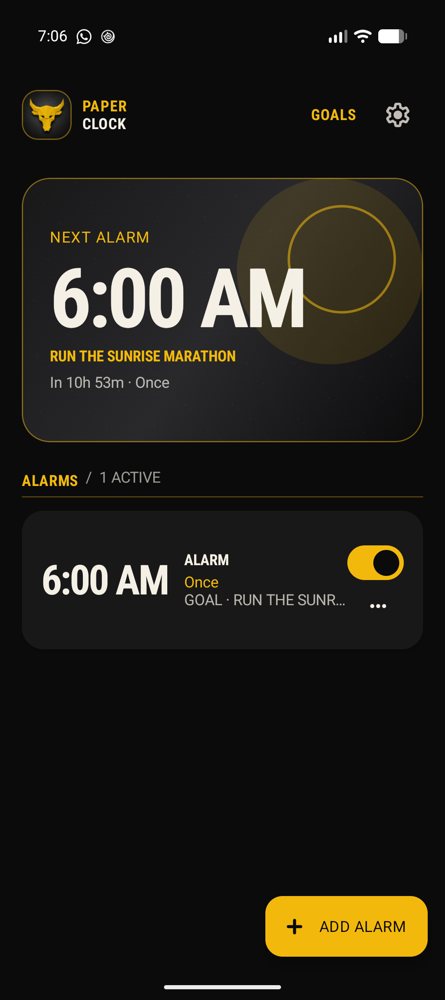
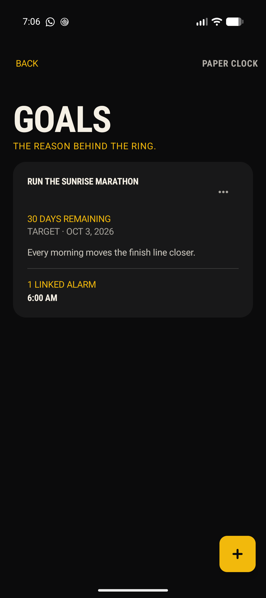
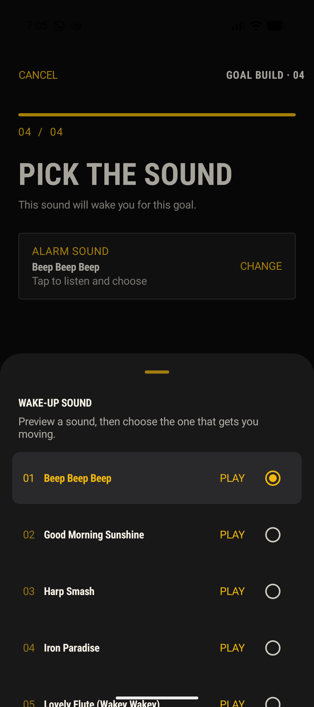
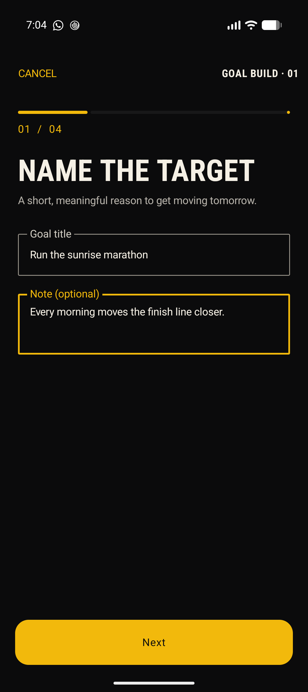
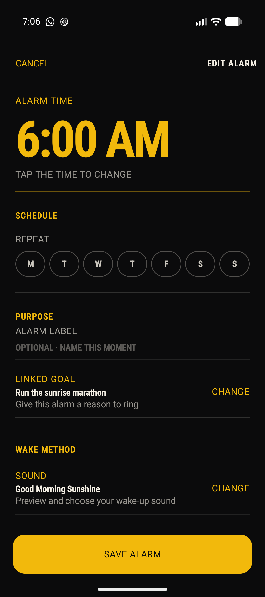

# PAPER CLOCK

> **Build mornings around something that matters.**

Paper Clock is a private, offline Android alarm clock for turning a meaningful goal into a morning routine. Set an alarm, link it to the reason you want to get up, choose a wake-up sound, and keep everything on your device.

<p align="center">
  
  
  
</p>

## A quieter kind of alarm clock

- **Wake with intent** — connect an alarm to a goal and see the reason behind the ring.
- **Make the morning yours** — set a time, repeat schedule, label, sound, and vibration.
- **Build a goal in four steps** — name the target, pick a date, set the alarm, and choose its sound.
- **Private by default** — goals, alarms, and settings stay on the device. There are no accounts or cloud sync.
- **Ready when it matters** — uses Android's exact alarm scheduling, survives device restarts, and presents a lock-screen-safe dismissal screen when an alarm rings.

## The flow

<table>
  <tr>
    <td width="50%" align="center"><br /><strong>1. Give tomorrow a target</strong></td>
    <td width="50%" align="center"><br /><strong>2. Build the alarm around it</strong></td>
  </tr>
</table>

## Home-screen widgets

Paper Clock includes three offline Android home-screen widgets:

- **Next Reason** (4×2, resizable) shows the next alarm, its linked goal, a live countdown, and an on/off control.
- **Quick Alarm** (2×2, resizable) opens a new Paper Clock alarm immediately.
- **Goal Countdown** (4×2, resizable) shows the nearest goal, target date, progress, and linked-alarm count.
- **Goal Focus** (2×2, resizable) is a compact days-left tile for the nearest goal.

Widget content refreshes when alarms or goals change, after reboot, and when the device date, time, or time zone changes.

## Build and install

**Requirements:** Android SDK platform 36, JDK 21+, and an Android device or emulator running API 26+.

```sh
export ANDROID_HOME=/path/to/Android/sdk
./gradlew assembleDebug
adb install -r app/build/outputs/apk/debug/app-debug.apk
```

The debug APK is written to `app/build/outputs/apk/debug/app-debug.apk`.

## Use

1. Tap **ADD ALARM** to set a time, repeat days, label, optional linked goal, sound, and vibration.
2. Tap **GOALS** and create a goal with its target date and first alarm.
3. Allow exact-alarm access when Paper Clock presents the system card. Android 13+ also requests notification access at launch.
4. When an alarm rings, Paper Clock loops the selected sound until **DISMISS ALARM** is pressed.

## Release builds

GitHub Actions builds an installable debug APK for every pull request targeting `main` and publishes it as a workflow artifact. Pushes to `main` also create a GitHub Release tagged as `v<versionName>-build.<runNumber>` with the APK attached.

These builds use the standard Android debug signing key and are intended for personal device installation—not Play Store distribution.

## Bundled wake-up sounds

Paper Clock packages its sounds with the app. The source tracks are MP3s at 44.1 kHz / 192 kbps, with durations of about 10.5–19.4 seconds. Their raw Android resources and display names are defined in `SoundCatalog.kt`.

| Resource | Display name |
| --- | --- |
| `beep_beep_beep` | Beep Beep Beep |
| `good_morning_sunshine` | Good Morning Sunshine |
| `harp_smash` | Harp Smash |
| `iron_paradise` | Iron Paradise |
| `lovely_flute_wakey_wakey` | Lovely Flute (Wakey Wakey) |
| `old_school` | Old School |
| `ring_ring` | Ring Ring |
| `the_roar` | The Roar |

## Screenshots

Play Store-ready 9:16 images and the full native captures are in [`screenshots/`](screenshots/README.md).
