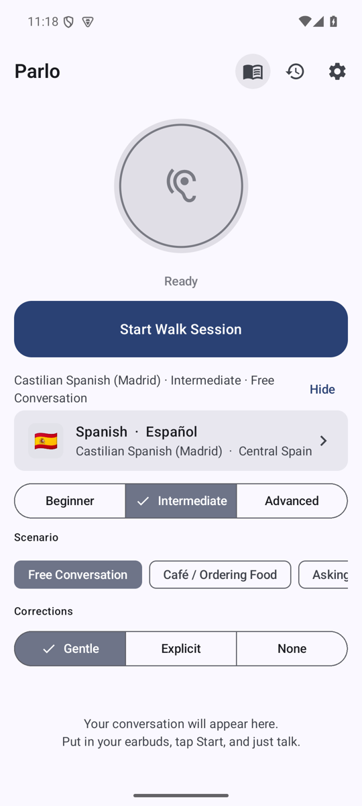
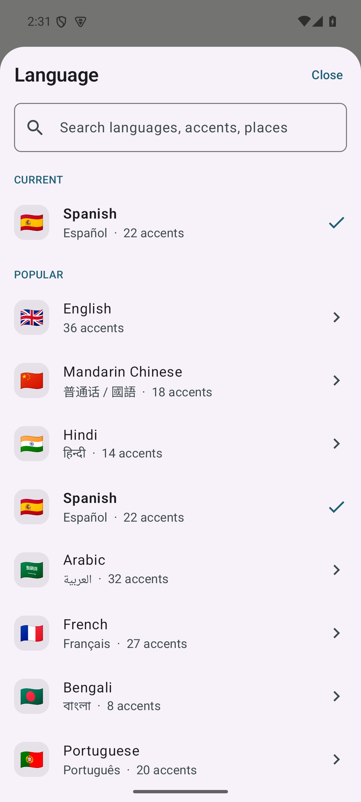
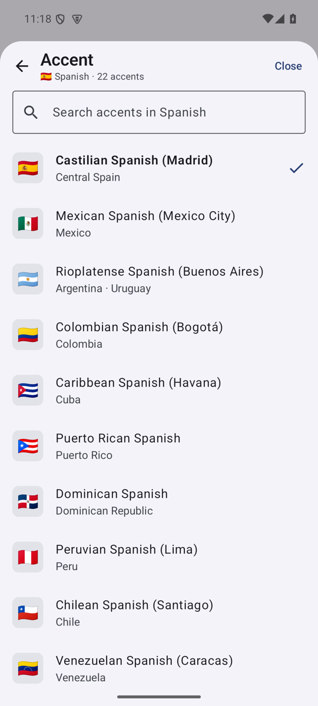
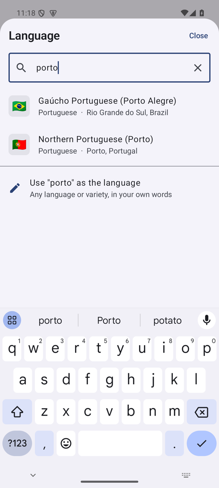
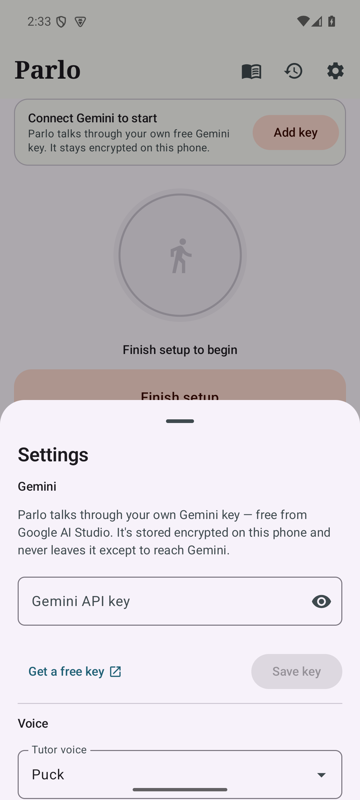
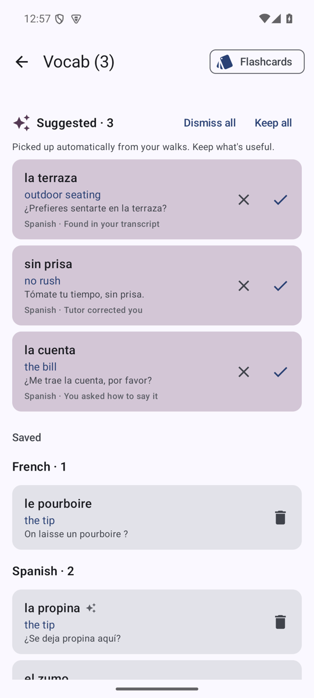
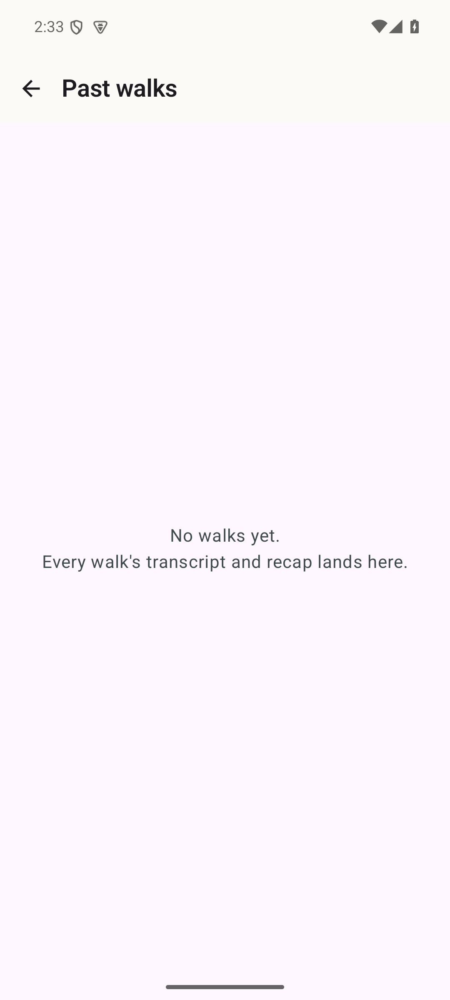

# Parlo

A hands-free, real-time voice language tutor for Android. Put your phone in your pocket, put earbuds in, go for a walk, and talk with Gemini in the language you're learning.

Native Kotlin + Jetpack Compose (Material 3), Gemini Live API over WebSockets. Single user, no accounts, no backend.

## Screenshots

| Main screen | Language picker | Accent picker | Search (languages, accents, places) |
| --- | --- | --- | --- |
|  |  |  |  |

| Settings (API key, voice, model) | Vocabulary (auto-captured suggestions on top) | Session history |
| --- | --- | --- |
|  |  |  |

*Captured on an API 35 emulator with no API key configured; tapping **Start Walk Session** without a key opens Settings instead of connecting.*

## Features

- **Live voice conversation** with the Gemini Live API (bidirectional audio streaming over WebSocket)
- **Hands-free walking mode**: foreground service with microphone type, notification controls (mute / end), MediaSession headset button support, audio focus, earcons for state changes
- **Bluetooth / wired earbud routing** with mid-session route changes
- **Barge-in**: interrupt the tutor at any time; playback flushes instantly
- **137+ languages, 800+ regional accents**: a built-in catalog (`LanguageCatalog.kt`) covering every region — Europe, East/Southeast Asia, South Asia, Middle East & Central Asia, Africa, the Americas, Oceania — each language with its major regional accents/dialects (e.g. English × 36, Arabic × 32, French × 27, Spanish × 22). Picked through a searchable bottom sheet: language first (Popular + by region, native names, flags), then accent; search matches language names, native names, accent names and places ("porto", "Québec", "粤语"). Anything not in the catalog can still be typed in as a custom language or accent
- **Level / scenario / correction style** pickers, plus quick-switch chips of recent combos
- **Voice-driven switching**: say "let's switch to Portuguese" and the tutor calls `switch_language` mid-session
- **Vocabulary**: say "save that word" and the tutor calls `save_vocab`; review in a list or flashcard mode
- **Automatic vocab capture** — no need to ask:
  - *In-session*: the tutor has a silent `note_vocab` tool it calls whenever you show a gap (ask what a word means, ask how to say something, stall, answer in English, get corrected) or introduces a genuinely useful new word. Nothing is spoken; the word lands in Vocabulary as a **Suggested** entry with the reason ("You asked what it means", "Tutor corrected you", …).
  - *After the session*: the stored transcript is sent once to Gemini `generateContent` (JSON mode) to mine words you didn't know or the tutor introduced, skipping anything already in your list. Sessions with fewer than two learner turns are skipped. Runs in the background after the recap; you can also re-run it from a session's history page (✨).
  - Suggested entries sit in their own tray at the top of Vocabulary — keep / dismiss individually or all at once. Kept words join the normal list and flashcards.
- **Session history** with full transcript and spoken end-of-session recap (long-press End to skip the recap)
- **Automatic model discovery**: lists models advertising `bidiGenerateContent`, prefers the newest native-audio Live model, and lets you override with free text
- **Resilience**: session resumption handles, exponential-backoff reconnect, connectivity monitoring, fresh-session fallback with recent-transcript context
- **Encrypted API key storage** via `EncryptedSharedPreferences` (Android Keystore)

## Requirements

- Android 8.0 (API 26) or newer; targets API 35
- JDK 17
- Android SDK Platform 35 and Build-Tools 35.0.0
- A Gemini API key from [Google AI Studio](https://aistudio.google.com/apikey)

## Build & install

```bash
# point Gradle at your SDK (or set ANDROID_HOME)
echo "sdk.dir=$HOME/Android/Sdk" > local.properties

./gradlew :app:assembleDebug
adb install -r app/build/outputs/apk/debug/app-debug.apk
```

Or open the project in Android Studio (Ladybug or newer) and press Run.

Lint: `./gradlew :app:lintDebug`

## Tests

None of the tests need a Gemini API key or network access.

```bash
# JVM unit + integration tests (~10 s)
./gradlew :app:testDebugUnitTest

# Instrumented tests: needs a connected device or running emulator
./gradlew :app:connectedDebugAndroidTest
```

| Suite | Where | What it covers |
| --- | --- | --- |
| `GeminiLiveClientIntegrationTest` | `app/src/test` | Drives the real `GeminiLiveClient` over OkHttp against an in-process fake of the Live WebSocket endpoint (`MockWebServer`): setup handshake and `?key=` auth, `setupComplete` gating, PCM `realtimeInput`, `clientContent`, `toolResponse`, decoding of audio / transcripts / tool calls / cancellations / `interrupted` / `turnComplete`, resumption-handle tracking, `goAway` reconnect that resumes with the handle, fallback to a fresh session when the server rejects the handle, fatal `403` → `InvalidApiKey` with no retry, and exponential backoff after a transient drop. |
| `LiveModelDiscoveryTest` | `app/src/test` | `/models` pagination, `bidiGenerateContent` filtering, ranking (newest native-audio Live model first), API-key error surfacing. |
| `MessagesTest` | `app/src/test` | Exact JSON shape of every client message and tolerant parsing of server messages (unknown fields ignored). |
| `LanguageCatalogTest` | `app/src/test` | Catalog breadth and integrity (every language has accents, unique names), case-insensitive / native-name lookup, search ranking, default config points at a real entry. |
| `PromptBuilderTest`, `ToolHandlerTest`, `GeminiApiTest` | `app/src/test` | System prompt contents per language/dialect/level/scenario/correction style; `save_vocab` / `note_vocab` / `switch_language` declarations, execution and responses (silent suggestion, dedupe, promotion of a suggestion by an explicit save); error classification. |
| `VocabMinerTest` | `app/src/test` | Post-session transcript mining against a `MockWebServer` fake of `generateContent`: request shape (JSON mode, schema, transcript, known-word exclusions), model fallback on 404, fenced/malformed output, dedupe and cap, no request when the learner never spoke. |
| `ParloDatabaseTest`, `ParloDatabaseMigrationTest` | `app/src/androidTest` | Room DAOs on-device: session/turn ordering and cascade delete, recap persistence, empty-session cleanup, vocab grouping, suggestion find/keep/dismiss, `minedAt`; schema auto-migration 1 → 2 keeps existing vocab as kept manual entries. |
| `MainScreenSmokeTest`, `VocabScreenTest` | `app/src/androidTest` | Launches `MainActivity`, checks the pickers render, drives the language picker (search → accent selection, custom accent entry), that Start without a key opens Settings, and that Vocab / History are reachable. Renders the Vocab screen against the real store and drives the Suggested tray (keep one, dismiss one, keep all). |

What is *not* covered automatically: a real Gemini Live session (audio quality, model behaviour, actual resumption handles). That needs a key and a phone with earbuds; see [First run](#first-run).

## First run

1. Open Parlo and tap the gear icon.
2. Paste your Gemini API key and tap **Save**. It is stored encrypted on-device and never leaves the phone except in requests to `generativelanguage.googleapis.com`.
3. Tap **Refresh** under *Model* to discover Live-capable models. The best native-audio model is picked automatically; type a model name to override.
4. Pick a voice (Puck, Aoede, Charon, Kore, Fenrir, Leda, Orus, Zephyr).
5. Back on the main screen choose language, dialect, level, scenario, and correction style, then tap **Start**.

Parlo will ask for **microphone**, **notification** (Android 13+), and **Bluetooth** (Android 12+) permissions the first time you start a session.

## Talking to the tutor

The tutor speaks first and keeps turns short. Things you can say at any time (in either language):

- "Repeat that slowly"
- "What does ___ mean?" / "How do I say ___?"
- "Correct me more" / "Stop correcting me"
- "Save that word" → stored to Vocabulary (words you struggle with are also captured silently — see *Automatic vocab capture*)
- "Let's switch to Italian" / "Make it easier" → switches language / level live

Changing language, dialect, level, scenario, or correction style in the UI during a session sends a text turn to the tutor. Changing voice or model reconnects with session resumption so context is kept.

## Project layout

```
app/src/main/java/com/parlo/app/
  ParloApp.kt              Application + manual DI container
  MainActivity.kt
  model/                   SessionConfig, LiveSessionState, enums
  data/                    Room DB (sessions, turns, vocab), Settings (encrypted + DataStore), model discovery
  gemini/                  GeminiApi (URLs/version), Messages (wire types), GeminiLiveClient (WebSocket),
                           PromptBuilder (system prompt + tools), ToolHandler
  audio/                   MicrophoneStreamer, AudioPlayer, AudioRouteManager, Earcons
  service/                 LiveSessionService (foreground service, MediaSession, reconnect, recap)
  ui/                      Compose screens: main, settings, vocab, history; MainViewModel; theme; nav
```

## Gemini Live details

- Endpoint: `wss://generativelanguage.googleapis.com/ws/google.ai.generativelanguage.v1beta.GenerativeService.BidiGenerateContent?key=…`
  (API version is centralised in `GeminiApi.API_VERSION`)
- Input: 16 kHz mono 16-bit PCM, ~30 ms chunks, base64 in `realtimeInput.audio`
- Output: 24 kHz mono 16-bit PCM played via `AudioTrack` with a jitter buffer
- Setup enables `AUDIO` response modality, input/output transcription, session resumption, sliding-window context compression, and the `save_vocab` / `note_vocab` / `switch_language` tools.
- Post-session vocab mining is the only non-Live call: one `POST /v1beta/models/{model}:generateContent` with `responseMimeType: application/json` (tries `gemini-2.5-flash`, then `gemini-2.0-flash`, then `gemini-flash-latest`).

## Privacy

Everything (transcripts, vocab, settings) is stored locally in the app's private storage. Backups are disabled. The only network traffic is to Google's Gemini API using your own key: the Live session itself, model discovery, and one post-session `generateContent` call that sends that session's transcript for vocab mining.
