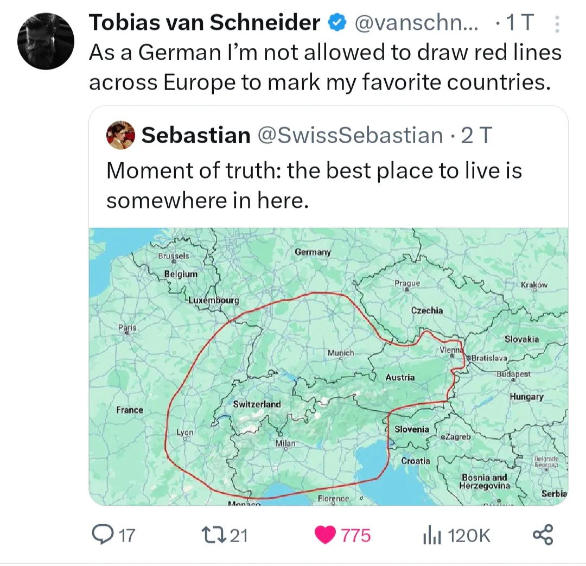
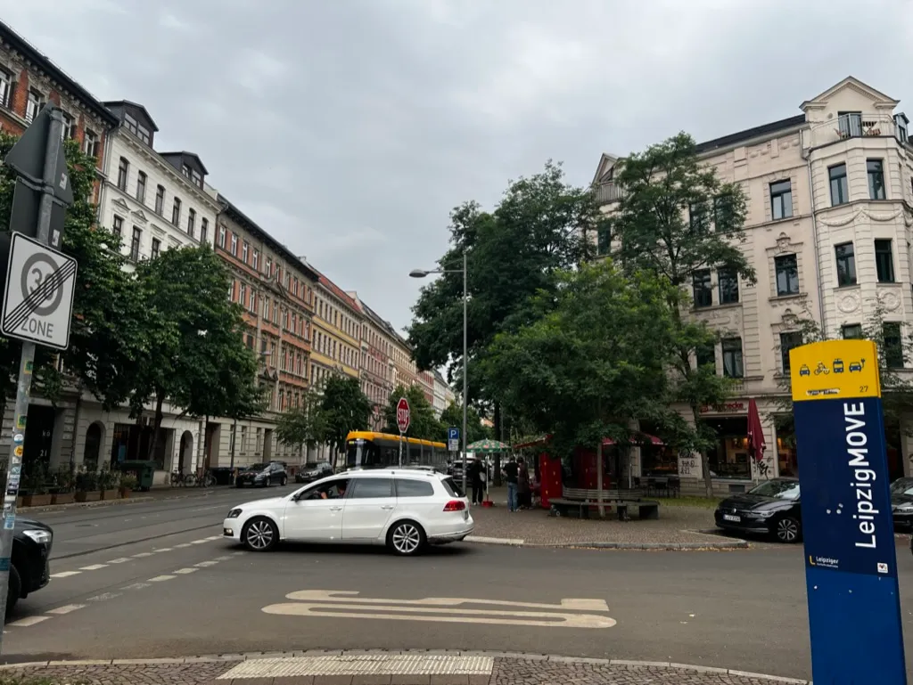

*“Eine fremde Sprache zu haben bedeutet, eine zweite Seele zu besitzen” - Karl der Große (Charlemagne)*

Sprachenlernen ist eine meiner Lieblingsaktivitäten aber es war nicht immer so. Ich bin nur mit Englisch aufgewachsen und hab außer dem Schulunterricht keine anderen Sprache gelernt. Das war eine Schade weil meine Mutter aus Deutschland kommt und hälfte meine Familie lebt in Bayern wo sie ja nur Deutsch spricht! In 2020 hatte ich endlich Deutsch zu lernen versucht und heute hab ich genug Deutsch, um bequem in Deutschland leben und mit meiner Oma sprechen zu können. Seitdem hab ich an vielen Orten in Deutschland gelebt, darunter Leipzig, München, und Berlin wo ich immer meinen Verständnis der Kultur sowie meinen Akzent verbessert hab. Der Prozess des Deutschlernens war für mich super transformativ und andere haben mich gefragt, wie ich es geschafft hab, eine andere Sprache zu lernen, also dachte ich, ich kann hier meinen Prozess dokumentieren.

# Anfang

Vor allem muss man immer einen Zweck un ein Ziel haben. Dieser Zweck muss für Sie relevant sein und das Ziel muss sehr spezifisch und diskret sein z.B. mein Zweck war es, mit meiner Familie in Deutschland zu leben und zu kommunizieren und mein Ziel war mit meiner Oma 30 Minuten zu reden. “Ich will fließend sein” ist nicht ein Zeil und “Einmal wird es nützlich sein” ist nicht genug

Mit einem Ziel kann man entscheiden wie man lernen möchte und was wichtig ist. Mann kann sich konzentrieren auf Schreiben, Lesen, Zuhören, oder Reden und es kommt auf seinem Ziel. Ich wusste mit meiner Oma reden also konzentriere ich mich auf Reden. Wenn ich einen Beruf in Deutschland denn vielleicht muss ich mich auf Schreiben und Lesen konzentrieren.

# Anfänger

Mir gefällt Duolingo. Es ist einfach, macht süchtig, und ist “gamified”. Ich glaube Duolingo ist perfekt für Anfängern da man ein gutes Verständnis erlangen kann, einschließlich Grammatik, Grundvokabular, usw. (1737 Tage Streak btw 😎). Offline sind Karteikarte auch gut und nützlich.

Ich hatte am Anfang viel Karteikarte und Duolingo benutzt und sie sind super für Grüße, Phrasen, und gebräuchliche Wörter. Die ersten Paar Wochen hatte ich nur Passivlernen benutzt und sogar mit ihnen allein fand ich es für einfache Interaktionen gut genug.

# Mittelstufe

Echte Gespräche sind entscheidend und der Grund, warum man eine neue Sprache lernt. Deshalb muss man damit üben, wenn man die neue Sprache lernen will. Online sind die beste Ressourcen (für mich) Youtube, Discord, und Spotify Podcasts. Mein Lieblings-Youtube-Kanal und Podcast war und ist noch [Easy German](https://www.youtube.com/@EasyGerman). Was für ein toller Youtube-Kanal. Großer Katalog, einfache und schwere Videos, interessante Themen, sehr gut 🤌 Kinderbücher sind auch gut für etwas Offline.

Youtube und Podcasts sind noch Passiv also mir gefällt auch Videospielen mit Leute im Internet über Discord. Normalwiese für mich war es Schach oder was. Ich konnte zocken und Activlernen, das heißt, ich war auch Teilnehmer des Gesprächs. Discord war und ist noch eine einfache Möglichkeit Schimpfwörter zu üben lol.

Nach einigen Monaten konnte ich Gespräche ziemlich gut verstehen und manchmal konnte ich auf Deutsch antworten wenn die Themen einfach war.

# Fortgeschrittene

Wenn der Lernfortschritt langsamer wird, wird das Sprachenlernen zu einem langsamen Prozess für immer tiefere Kenntnisse. Dafür mir gefällt Luca Lampariellos Bidirektionale-Übersetzung-Methode. Die Methode besteht darin, dass ich, wenn ich etwas interessante lese z.B. die Nachrichten, ein Buch, usw., es ins Englische und dann wieder zurück ins Deutsche übersetze. So übe ich sowohl aktives als auch passives Lernen. Ich mache auch heute noch Bidirektional-Übersetzung.

<YouTube url="https://www.youtube.com/watch?v=oOT0Upi-Mn8" />

Schließlich muss man sich irgendwann eintauchen. Das ist nur meine Meinung, aber ich denke, jeder, der eine Sprache lernt, sollte eine Akzent lernen und das vollständige Eintauschen macht das möglich. Ich hab jetzt eine kleine Bayrische Akzent aber ich verstehe böhmische und sächsische Akzente ziemlich gut weil ich in der Nähe von Eger und in Leipzig gelebt hab.

<Callout type="info">
Kurzer Hinweis nebenbei: Ich hab alle meine Experimente in einem Notion-Template gebündelt, das du dir anschauen kannst – [Language Hub](https://language-hub.jonaylor.com/). Es vereint Mindset, Methode und Planung in einem Dashboard, damit du deinen Sprachlernprozess wie eine kleine Missionskontrolle managen kannst (ich tracke damit Deutsch, Spanisch und Katalanisch parallel).

- Mindset zuerst: Prompt-Kacheln helfen, Motivation und Fokus wach zu halten.
- Methode klar: Schritt-für-Schritt-Guides für Bidirektionale Übersetzungen, aktive Wiederholung und Reflexion.
- Rhythmus fix: ein flexibles Wochenboard plant Sessions, loggt Fortschritt und zeigt, was als Nächstes dran ist.
- Ressourcen im Griff: Sprachen-Datenbank, verlinkte Artikel/Videos und ein Hub für alle Übungen.

Bonus: Es gibt vorgefertigte Bereiche für Deutsch, Spanisch, Katalanisch, Mandarin, Französisch, Griechisch, Arabisch und Latein – ideal, wenn du mehrere Sprachen jonglierst oder erst austesten willst, welche Sprache du als nächstes lernst.
</Callout>

# Ende

Ich bin ein “math guy” also meine eigene Sprache zu verstehen, geschweige denn eine andere Sprache, war für mich nicht immer wichtig. Jetzt würde ich sagen dass Deutsch ist eine meiner besten Errungenschaften und eine der besten Nutzungen meiner Zeit. Sprachenlernen kann jemand sehr beeinflussen. Der Prozess hat mein Gehirn und meine Denkweise völlig neu verdrahtet. Ich hab das Wort “Enculturation” schon mal gehört und ich denke das ist irgendwie was passiert ist. Ich fühle mich deutscher als zuvor: ich verstehe den Humor, die Gewohnheiten, die Kultur. Ich kann es nur empfehlen eine Sprache zu lernen.

Vielleicht das nächste Mal werde ich schreiben warum ich spanisch und katalanisch gelernt hab.

