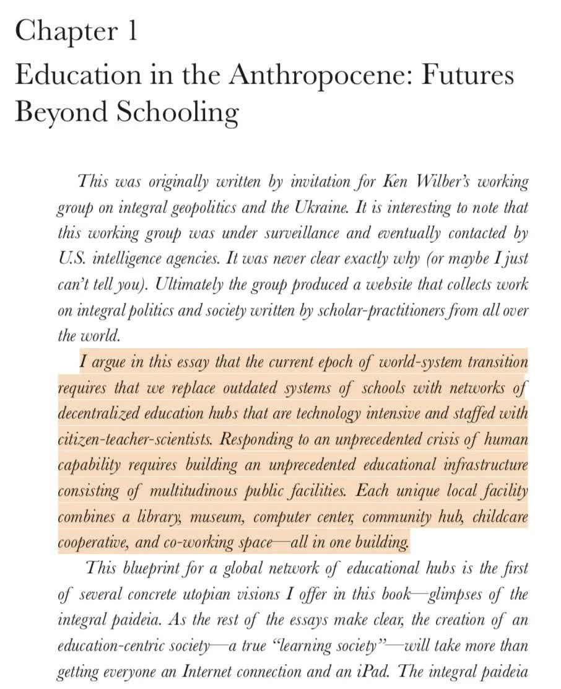

# Intro

Robert Greene’s [*Mastery*](https://www.amazon.com/Mastery-Robert-Greene/dp/014312417X) presents a compelling framework for how individuals rise to excellence: through apprenticeship, creative experimentation, and ultimately intuitive mastery. His work captures the trajectory of adults who have already chosen their field and committed to years of disciplined effort. Yet Greene begins the story midstream. He does not ask how a person comes to the threshold of apprenticeship, or what prepares them to undertake the demanding path toward mastery.

The framework I propose addresses this missing prelude. Before apprenticeship, there are three developmental stages—Premier (childhood), Defining (adolescence), and Cooperative (young adulthood)—that shape how a person discovers their interests, develops foundational skills, and integrates into a community of learning. Within these stages, three capacities prove essential: creativity, communication, and mastery. Together, they form the groundwork upon which Greene’s model depends.

What follows is not a rival to *Mastery*, but its prequel: a map of the years before formal apprenticeship, where curiosity, guidance, and early practice cultivate the soil from which mastery can grow.

# **Primary Focuses**

## **Creativity — Creation of New Ideas**

- Conceptual understanding of topics
- Thought Experiments

## **Communication skills — Distribution of New Ideas**

- Speaking
- Listening
- Reading
- Writing

---

# **Stages**

## **Premier Stage (Birth — Puberty) ≈ (0–12)**

- Parents/guardians must be present during a majority of learning
- Children are exposed to a variety of topics with the hope for them to become interested in one or a few

## **Defining Stage (Puberty) ≈ (12–16)**

- Students pick a general field of study to get more involved with
- The parents, although still important, become less of a factor in the student’s education making way for the community as a whole to become the student’s guide.

## **Cooperative Stage (Puberty — Adulthood) ≈ (16–20)**

- Learning is split between hands-on work with the community (Similar to how modern society today has internships and co-ops) and thought experiments in groups and individually
- Professional mentors in the topic of the student’s choosing will be pivotal in integrating the students into professional life

---

# **Society’s Roles**

Education and society are directly related. A complete reconstruction of the public educational system cannot happen without a complete reconstruction of society. The proposed system for teaching the future generations revolves heavily on more interconnected communities. There are no “teachers” or “administrators” because everyone is a teacher and the community as a whole administers the education of their youth. The way society is structured today with its competitive atmosphere and bureaucratic, inhuman nature would make this proposed system virtually impossible.

---

# **Creativity**

## **Conceptual Understanding of Topics**

A conceptual understanding of topics and subjects of study will be far more emphasized than memorization of arbitrary facts and specific equations. By having students understand concepts rather than facts, individuals would be able to more easily contribute new ideas. One doesn’t necessarily need every fact or equation about a subject to be able to brainstorm about it, one only needs to understand the concept of the subject.

## **Thought Experiments**

To boost student’s creativity, extensive time will be allocated for individual and group thought experiments where students will have the opportunity to come up with new and innovative ideas.

---

# **Communication Skills**

Humans evolved thousands of years ago with extraordinary communication skills. For the first time in the history of the Earth, information could be shared among individual creatures easily and effectively. Public education must be used to help improve some of human’s greatest assets.

## **Speaking**

- Public speaking
- Conversing in Social Environments

## **Listening**

- Effective Note Taking
- Comprehending material from public speakers
- Conversing in Social Environments

## **Reading**

- Understanding reading material
- Reading Strategies
- Speed reading

## **Writing**

- Conveying information accurately across books or journals
- Writing letters or messages to individuals

---

# **The Three Stages of Growth**

### Premier Stage (Birthday - Puberty i.e. 0-12)

- Parents and Guardians must be present during a majority of learning
- Children are exposed to a variety of topics with the hope for them to become interested in one of a few

### Defining Stage (Puberty i.e. 12-16)

- Students pick a general field of study to get more involved with
- The parents although still important become less of a factor in the students’ education making way for the community as a whole to become the students’ guide

### Cooperative Stage (Puberty - Adulthood i.e. 16-25)

- Learning is split between hands on work (similar to interns or coops) and thought experiments in groups + individually
- Professional mentors in the topic of the student’s choosing will be pivotal in the integrating the student into professional life

# **The Three Pillars**

### Creativity

**Conceptual Understanding of Topics**

A conceptual understanding of topics and subjects of study will be far more emphasized than memorization of arbitrary facts and specific equations. By having the students understand concepts rather than facts individuals would be able to more easily contribute to new ideas. One doesn’t necessarily need every fact or equation about a subject to be able to brainstorm about it, one only needs to understand the concept of the subject

**Thought Experiments**

To boost students’ creativity, extensive time will be allocated for individual and group thought experiments where students will have the opportunity to come up with new and innovative ideas.

### Communication Skills

Humans evolved thousands of year aho with extraordinary communication skils. For the first time in the history of Earth, information could be shared among individual creatures easily and effectively. Public education must be use to help improve one of man’s greatest assets

Speaking:

- public speaking, conversing in social environments

Listening

- effective note taking, comprehending material from public speakers / lecturers

Reading:

- understanding reading material, reading strategies, speed reading

Writing

- conveying information across books or journals, writing letters or messages to individuals

### Mastery

Have a thing you master

# Conclusion

- Return to your opening idea or anecdote.
- Summarize in one sentence: what education and growth mean to you.
- Leave the reader with a forward-looking thought: how you want to continue learning, creating, and mastering.
