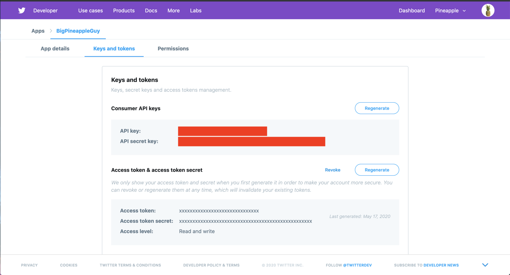
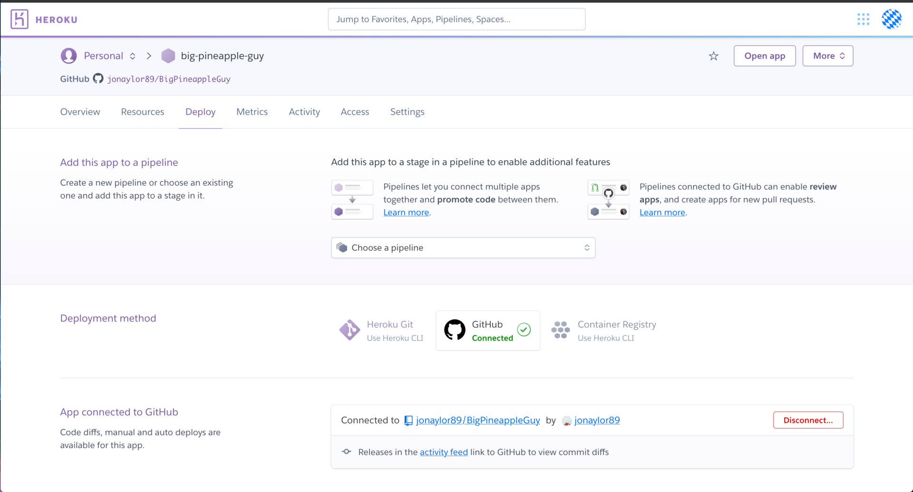

### Intro
This is a short, step by step, tutorial for how to make a twitter bot. The bot I'll create in this tutorial is going to be called "Big Pineapple Guy" and it's purpose will be to comment on my friend's posts with facts about pineapples. I'm going to be making the bot in Go and I'm going to be deploying it onto Heroku so everything will be free. The end result of this will be a bot that comments stuff like this:


All the code for this can be found [here](https://github.com/jonaylor89/BigPineappleGuy)

### Getting Twitter Credentials
I want my bot to have its own Twitter account so step one for all of this is to go to Twitter create a new account for the bot.


Next I need api access to this account. To do that, I need to register as a developer at [https://developer.twitter.com](https://developer.twitter.com/). From there, I create a new app and fill it in with basic info about what the bot will be doing.


Once the app is created, I can go in an get the keys and tokens I need.



### Loading Credentials

I'm going to take the keys and tokens that Twitter gave me and put them in a yaml file for now to access them during development.

`creds.yml`
```yaml
ConsumerKey: YOUR_CONSUMER_KEY
ConsumerSecret: YOUR_CONSUMER_SECRET
AccessToken: YOUR_ACCESS_TOKEN
AccessSecret: YOUR_ACCESS_SECRET
```

For the first bit of go code, I'm going to write something to get these credentials from the yaml file. There is a library for parsing yaml that I'll need first.

```bash
go mod init  # initializing a go module to keep track of dependencies
go get gopkg.in/yaml.v2
```

Now that I have the library, I can write the basic function to get the credentials. I decided to put it in its own file to keep things clean.

`creds.go`
```go
package main

import (
    "fmt"
    "os"
    "log"
    "io/ioutil"
    "gopkg.in/yaml.v2"
)

const (
    credsFile = "creds.yml"
)

type creds struct {
    ConsumerKey    string `yaml:"ConsumerKey"`
    ConsumerSecret string `yaml:"ConsumerSecret"`
    AccessToken    string `yaml:"AccessToken"`
    AccessSecret   string `yaml:"AccessSecret"`
}

func getCreds() *creds {
    c := &creds{}

    // Read File
    yamlFile, err := ioutil.ReadFile(credsFile)
    if err != nil {
        log.Fatalf("[ERROR] %v", err)
    }

    // Unmarshall Creds
    err = yaml.Unmarshal(yamlFile, c)
    if err != nil {
        log.Fatalf("[ERROR] %v", err)
    }

    return c
}
```

So far the directory for the project should look like this:

```
.
├── creds.go
└── creds.yml
```

### Adding a Main

Before programming a main, I have to find a good twitter API client library for go. Fortunately, there seems to be a really go one by a Github user named [dghubble](https://github.com/dghubble/go-twitter).

```bash
go get github.com/dghubble/go-twitter/twitter
```

I want my bot to listen for new tweets from specific twitter handles and run some code whenever that happens. This can be done by listening to twitter event streams. Twitter gives developers the ability to listen for events and filter out unwanted events. The documentation for it is [here](https://developer.twitter.com/en/docs/tweets/filter-realtime/overview). In my case, I want to filter by specific twitter handles. The go twitter library I'm using has an example of how to listen to twitter streams ([https://developer.twitter.com/en/docs/tweets/filter-realtime/overview](https://github.com/dghubble/go-twitter/blob/master/examples/streaming.go)). Going off this example, I can create the basic main function for my bot.

`main.go`
```go
package main

import (
    "fmt"
    "log"
    "os"
    "os/signal"
    "syscall"
    "github.com/dghubble/oauth1"
    "github.com/dghubble/go-twitter/twitter"
)

func main() {
    creds := getCreds()

    if creds.ConsumerKey == "" || creds.ConsumerSecret == "" || creds.AccessToken == "" || creds.AccessSecret == "" {
        log.Fatal("Consumer key/secret and Access token/secret required")
    }

    config := oauth1.NewConfig(creds.ConsumerKey, creds.ConsumerSecret)
    token := oauth1.NewToken(creds.AccessToken, creds.AccessSecret)

    // OAuth1 http.Client will automatically authorize Requests
    httpClient := config.Client(oauth1.NoContext, token)

    // Twitter Client
    client := twitter.NewClient(httpClient)

    // Convenience Demux demultiplexed stream messages
    demux := twitter.NewSwitchDemux()

    demux.Tweet = func(tweet *twitter.Tweet) {
        fmt.Println("[INFO] ", tweet.Text)
    }

    demux.DM = func(dm *twitter.DirectMessage) {
        fmt.Println("[INFO] DM: ", dm.SenderID)
    }

    demux.Event = func(event *twitter.Event) {
        fmt.Printf("[INFO] Event: %#v\n", event)
    }

    fmt.Println("Starting Stream...")

    // FILTER
    filterParams := &twitter.StreamFilterParams{
        Track:         []string{"cat"},
        StallWarnings: twitter.Bool(true),
    }

    stream, err := client.Streams.Filter(filterParams)
    if err != nil {
        log.Fatal(err)
    }

    // Receive messages until stopped or stream quits
    go demux.HandleChan(stream.Messages)

    // Wait for SIGINT and SIGTERM (HIT CTRL-C)
    ch := make(chan os.Signal)
    signal.Notify(ch, syscall.SIGINT, syscall.SIGTERM)
    log.Println(<-ch)

    fmt.Println("Stopping Stream...")
    stream.Stop()
}
```

The `demux` is what is used to separate the different message types in the stream. For each message type (i.e. Tweet, DM, Event) I register a callback that is called every time one of those events happens. For now I'm just printing the messages out when I receive them.

Above the main function, I'm going to put a variable that is an array of all the Twitter handles I want to filter.

```go
var victims = []string{
    "A_Chris_Kahuna",
    "georgiopizzeria",
    "HakaRoland",
}

func main() {
    // ...
```

Unfortunately, I can't filter by just Twitter handles, only Twitter *IDs.* So I'll need to write something that converts the array of Twitter handles into an array of Twitter IDs.

```go
import (
    // ...
    "strconv"
    // ...
)

// ...

// Twitter Client
client := twitter.NewClient(httpClient)

var ids = []string{}
for _, name := range victims {
    // User Show
    user, _, err := client.Users.Show(&twitter.UserShowParams{
        ScreenName: name,
    })
    if err != nil {
        fmt.Println("[ERROR] on ", name)
        continue
    }
    ids = append(ids, strconv.FormatInt(user.ID, 10))
}

// Convenience Demux demultiplexed stream messages
demux := twitter.NewSwitchDemux()
// ...
```

Using this new `ids` array, I can filter the stream.

```go
// ...
fmt.Println("Starting Stream...")

// FILTER
filterParams := &twitter.StreamFilterParams{
    Follow:        ids,
    StallWarnings: twitter.Bool(true),
}

stream, err := client.Streams.Filter(filterParams)
if err != nil {
    log.Fatal(err)
}

// Receive messages until stopped or stream quits
go demux.HandleChan(stream.Messages)
// ...
```

Now that I'm filtering by Twitter IDs and only getting the tweets I want, I can start writing some logic for what do when I receive a new Tweet message.

```go
demux.Tweet = func(tweet *twitter.Tweet) {
    // Ignore RTs
    if tweet.Retweeted {
        return
    }

    // Ignore Replies
    if tweet.InReplyToStatusID != 0 || tweet.InReplyToScreenName != "" || tweet.InReplyToUserIDStr != "" {
        return
    }

    fmt.Println("[INFO] Tweet: ", tweet.Text)
}
```

In the Twitter API, tweets have a ton of field. In the library I'm using, [this file](https://github.com/dghubble/go-twitter/blob/master/twitter/statuses.go) has the Tweet struct with all of the available fields. I only want to interact with tweets tweeted directly from my fields, no retweets or replies so that was the first thing I make sure to avoid. With this, I have everything I need to move onto the fun part.

### Putting It All Together

Now I get to decide what I want to reply with. I want the reply to be a random pineapple fact so to keep things neat, I'm going to put the list of facts in a new file

`facts.go`
```go
package main var facts = [...]string{ "Pineapple can reach 3.3 to 4.9 feet in height. Large specimens of this fruit can reach nearly 20 pounds of weight.", "Pineapple is perennial herbaceous plant that has short and stocky stem. Its leaves are spiny and covered with wax on the surface.", "Fruit of pineapple is result of fusion of 100 to 200 individual flowers.", "Color of the fruit depends on the variety. Pineapples are usually red, purple or lavender in color.", "Christopher Columbus brought pineapple from South America to Europe. This fruit was first named \"pina\" because it looks like large pine cone. Englishmen later added name \"apple\" to denote it as a fruit.", "Two types of pineapples, called \"cayenne pineapple\" and \"red Spanish pineapple\" are currently cultivated and consumed throughout the world. They differ in color and size of the fruit.", "Birds (such as hummingbirds) and bats pollinate pineapples.", "One plant produces only one pineapple per season. Ripening process ends after removal of the fruit from the stem.", "Pineapple is rich source of fibers, manganese, vitamin C and vitamins of the B group. It can be consumed raw, in the form of juices, or as a part of various sweet and salty dishes. Pina colada is popular drink that is made of pineapples.", "Pineapple is used to alleviate symptoms of common cold, cough and nasal congestion (by decreasing the amount of mucus). It can reduce inflammation and prevent development of blood clots.", "Pineapple contains bromelain, a substance which decomposes proteins and facilitates digestion. People can use marinade made of pineapple juice to reduce toughness of the meat (bromelain acts as softener of meat).", "Pineapple can be easily cultivated using the crown of the fruit. Crown should be cut and partially dried before planting in the soil.", "South Asia is the biggest producer of pineapples. More than 2 million tons of pineapples are produced and exported from Philippines each year.", "Almost all parts of the pineapple can be used in the production of vinegar and alcohol. Inedible parts can be used as food for domestic animals.", "Pineapple can live and produce fruit for up to 50 years in the wild.", "Pineapples regenerate! You can plant pineapple leaves to grow a new plant.", "Hawaii produces about 1/3 of all pineapples in the world.", "Pineapples are a cluster of hundreds of fruitlets.", "Pineapples take about 18-20 months to become ready to harvest.", "Pineapple is the only edible fruit of its kind, the Bromeliads.", "One pineapple plant can produce one pineapple at a time.", "Pineapples ripen faster upside down.", "A pineapple is not an apple, or pine. It’s actually a berry!", "The world’s largest pineapple ever recorded was in 2011, grown by Christine McCallum from Bakewell, Australia. It measured 32cm long, 66cm girth and weighed a whopping 8.28kg!", "The Hawaiian word for pineapple is ‘halakahiki‘.", "The Dole Plantation’s Pineapple Garden Maze in Hawaii has the record for the largest maze in the world, stretching over three acres!", }
```

Using a random number generator in Go's standard library, I'm going to pick a random item from the list to reply with. It's very important to seed the number generator with the current time because of how I'm going to be deploying it later. This'll just make sure I'm *actually* using a random number.

```go
import (
    // ...
    "math/rand"
    "time"
    // ...
)

// ...

// Twitter Client
client := twitter.NewClient(httpClient)

rand.Seed(time.Now().UnixNano()) // Seed the random number generator

var ids = []string{}

// ...

// Ignore Replies
if tweet.InReplyToStatusID != 0 || tweet.InReplyToScreenName != "" || tweet.InReplyToUserIDStr != "" {
    return
}

choice := facts[rand.Intn(len(facts))] // Pick a random fact
botResponse := fmt.Sprintf("@%s Pineapple Fact: %s", tweet.User.ScreenName, choice)

fmt.Println("[INFO] Tweet: ", tweet.Text)
// ...
```

Finally, I'm going to add the logic for replying to the tweet.

```go
demux.Tweet = func(tweet *twitter.Tweet) {
    // ...

    // Reply to Tweet
    reply, _, err := client.Statuses.Update(
        botResponse,
        &twitter.StatusUpdateParams{
            InReplyToStatusID: tweet.ID,
        },
    )

    if err != nil {
        fmt.Println(err)
    }

    fmt.Println("[INFO] ", reply)
}
```

If everything is set up correctly and there are no bugs, I should be able to build and run this on my own machine.

```bash
go build
./BigPineappleGuy
```

To test, I added my own personal Twitter account to the array of victims and tweeted some test tweets. With everything working, I can move onto deploying the bot so I don't have to run it on my own computer.

## Deploying on Heroku

Before doing anything on Heroku, I'm going to have to make some changes to how I was running the bot. The first is how I'm getting the credentials. I **really** don't want to check my credentials into git and push them to Github so I'm going to modify the `cred.go` file to be able to accept credentials from environment variables.

`creds.go`
```go
func getCreds() *creds {
    c := &creds{}

    // Read File
    yamlFile, err := ioutil.ReadFile(credsFile)
    if err != nil {
        fmt.Println("[INFO] No yml config, pulling from environment")
        c = &creds{
            ConsumerKey:    os.Getenv("CONSUMER_KEY"),
            ConsumerSecret: os.Getenv("CONSUMER_SECRET"),
            AccessToken:    os.Getenv("ACCESS_TOKEN"),
            AccessSecret:   os.Getenv("ACCESS_SECRET"),
        }
    } else {
        // Unmarshall Creds
        err = yaml.Unmarshal(yamlFile, c)
        if err != nil {
            log.Fatalf("[ERROR] %v", err)
        }
    }

    return c
}
```

After this modification I can log into my Heroku account and make a new project. In this new project, I'm going to input all of my keys and tokens as environment variables through the web console.


Before actually deploying though, I'm going to add a `Procfile` to my project folder. This will tell Heroku that my project isn't actually a website and is just a bot.

`Procfile`
```
worker: BigPineappleGuy
```

At this point, my project folder looks like this:

```
.
├── Procfile
├── creds.go
├── facts.go
├── go.mod
├── go.sum
└── main.go
```

Now I'm ready to push all of my stuff to Github and point Heroku at my Github repo for deployment.



And with that I'm done! I have a Twitter bot written in go running on Heroku. This was a really fun project to make and it was really nice seeing my friends post pictures in our groupchat of a mysterious pineapple account commenting on their posts
