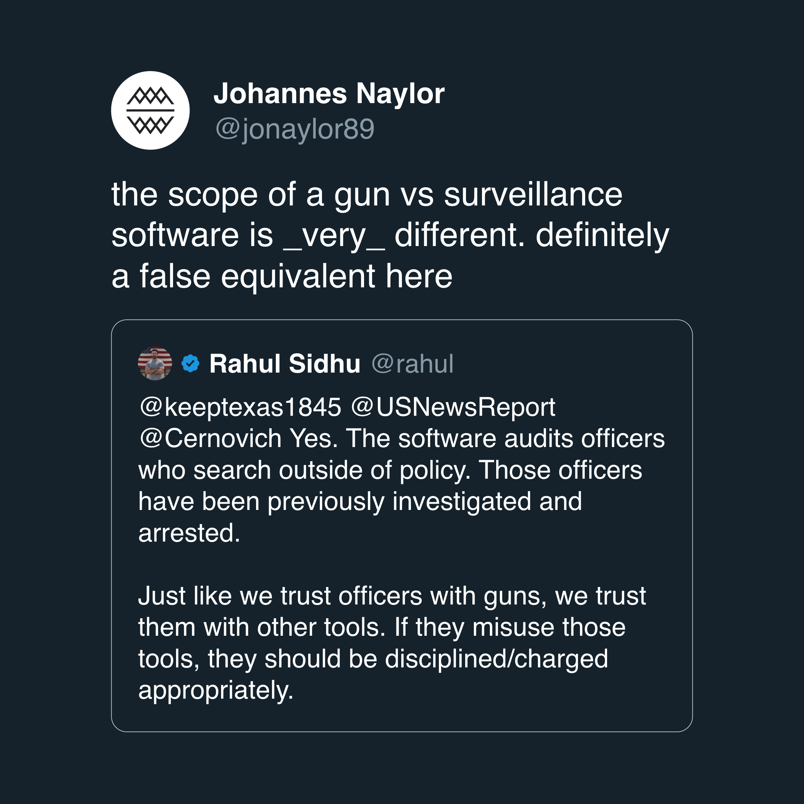
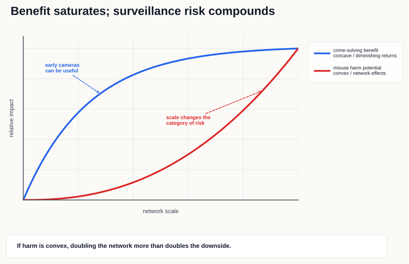
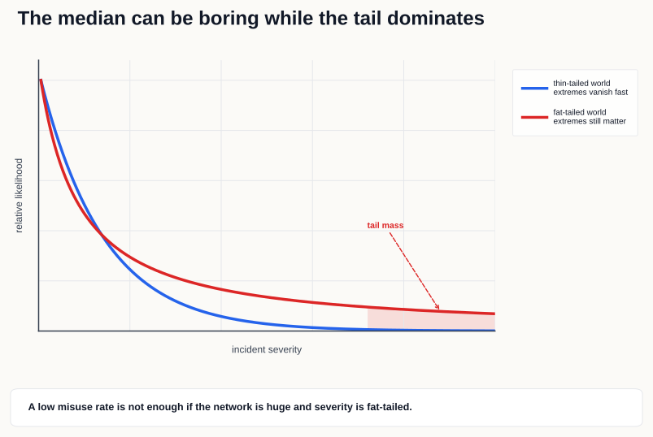

The surveillance company [Flock](https://flocksafety.com) has been all over my feeds lately, ranging from people hating on them to people shilling them because of a wide range of security and moral concerns. I generally try to ignore this kind of stuff online because it's mostly noise, but one comeback from Flock's PR team that seems to be repeated by shills stood out. In response to concerns about law enforcements or Flock employees using their surveillance software incorrectly (unintentionally or maliciously) the argument is basically: "just like we trust officers with guns, we trust them with these tools." In other words, a gun and surveillance software should be treated as the same kind of institutional risk.

That doesn't sound right to me, so [my first reaction](https://x.com/jonaylor89/status/2056589581240217744?s=20) to people in my network using this comeback to defend Flock was just:



The comparison sounds simple enough, but it compresses the problem into the wrong frame. We do trust police officers with dangerous tools (and you could separately argue whether _all_ law enforcement should have guns in the first place) but not all dangerous tools have the same failure mode or same tail risk. A "bad apple" with a gun can injure, let's say, a few hundred people max in an extreme case. A bad actor using Flock-style software, or a bug/security vulnerability in the system, can potentially affect millions of people with an almost unbounded impact.

## The Database of Civilian Movements

While one camera can be useful, the fleet of cameras is what allows law enforcement to reconstruct where a car/person was over time. So, not that anyone is making this argument, saying "it's a public street, anyone could have seen you/your car there." isn't valid because following someone and collecting data on their movements including enriched metadata is conventionally known as stalking. That being said, there are some pros to stalking every citizen in the country.

Returning stolen cars, bringing home missing persons/AMBER alerts, locating violent crime suspects, all positive things for a community and signifiacantly easier to do with a surveillance system. The first few cameras setup on busy roads or intersections in a community bring the most value per camera. Connecting more cameras to the network adds diminishing return i.e. benefit:camera ratio goes down. Obviously the same database can also show whether someone visited a protest, a clinic, a church, a mosque, a union meeting, a domestic violence shelter, or a journalist's source so for that I'd argue the potential for harm increases as more cameras are connected to the network e.g. one camera on an intersection doesn't really affect the average citizen but the more cameras that get connected, the more someone's individual moments can be tracked.

## A Small Model of the Risk

Let:

- `N` = number of cameras
- `r` = plate reads per camera per day
- `d` = retention period in days
- `a` = number of people/agencies with access

Then a rough "surveillance surface area" is:

```txt
S = N × r × d × a
```

**This is _obviously_ not a perfect measure**. The toy model, for one, captures the part that risk is multiplicative unlike with guns. If you double the cameras, double the retention period, and double the sharing network, you don't get double the surface area. You get something closer to 8x. A gun doesn't become 8x more dangerous because the department stores data longer or signs a sharing agreement with another jurisdiction, etc. etc..

Now imagine two functions over `S`:

```txt
Benefit: B(S) = b × (1 - e^(-kS))
Harm:    H(S) = h × S^γ, where γ > 1
```

The first function is concave. The first few cameras at high-value chokepoints might help a lot. The next cameras probably help less. Eventually you're mostly adding redundant coverage.

The second function is convex. More cameras, longer retention, more sharing, and more users don't merely add risk; they compound it. The database becomes more useful for legitimate investigations, but also more useful for illegitimate tracking.



The exact shape of these curves is debatable because I'm sure there's police data that could show the benefit curve perhaps being `log` or whatnot but still concave. If benefits are concave and harms are convex, then the policy question changes as the network scales. A small, local, tightly governed system might be a reasonable trade. A national, loosely shared, long-retention database might not be.

## Problems in the Tail

The median search query is boring.
* A detective searches for a stolen car, gets a hit, and recovers it.
* An Amber Alert goes out and a camera picks up the vehicle.
* A violent crime has only a partial plate or a vehicle description and the system generates a lead.

But surveillance systems shouldn't be judged only by the median case. For a surveillance network, most searches can be normal and the risk becomes the small number of searches that are personal, political, abusive, or simply outside the public's understanding of what the system was for.

If there are `Q` searches and each search has some small probability `p` of being improper, then the chance of at least one improper search is:

```txt
P(at least one misuse) = 1 - (1 - p)^Q
```

For small `p`, this is approximately:

```txt
P(at least one misuse) ≈ pQ
```

Thus if `Q` gets very large, "rare" means "almost certainly". That still understates the problem because the severity of misuse is not constant. Some improper searches are minor while others can expose sensitive travel, identify sources, protest attendance, or help an abusive person find someone trying to hide.

A toy way to model that is a fat-tailed severity distribution:

```txt
P(H > x) = (x_min / x)^α
```

When `α` is low enough, extreme events matter a lot. In some fat-tailed distributions, the variance is enormous or undefined.



Audits can reduce `p` but if `Q` is huge and the severity distribution is fat-tailed, lowering `p` does not make the system safe. The impact radius needs to be reduced i.e. shorter retention, less sharing, stricter access, and actual transparency.

## Documented Incidents

This isn't theoretical.

[404 Media reported](https://www.404media.co/a-texas-cop-searched-license-plate-cameras-nationwide-for-a-woman-who-got-an-abortion/) on a Texas officer using a nationwide license plate camera search in an abortion-related investigation. [EFF later argued](https://www.eff.org/deeplinks/2025/10/flock-safety-and-texas-sheriff-claimed-license-plate-search-was-missing-person-it) that the public explanation around that search did not match the audit-log details.

[404 Media also reported](https://www.404media.co/ice-taps-into-nationwide-ai-enabled-camera-network-data-shows/) that local police used Flock searches in ways that gave ICE access to the network indirectly. That's important because even if a city thinks of its cameras as local infrastructure, the data can become useful to agencies outside the local political bargain that approved the cameras.

And [another 404 Media story](https://www.404media.co/police-unmask-millions-of-surveillance-targets-because-of-flock-redaction-error/) showed how audit logs themselves can reveal huge amounts of sensitive search behavior when mishandled. Even the accountability layer can become a privacy problem.

[Flock has responded](https://www.flocksafety.com/blog/flock-safetys-response-to-illinois-lpr-data-use-and-out-of-state-sharing-concerns) to some of these concerns and argues that it audits access, enforces policy, and has changed features in response to state-level rules and reporting. The existence of fixes after embarrassing incidents doesn't invalidate the risk model and, in fact, confirms that the system's behavior is governed by defaults, contracts, access settings, product design, and audit incentives thus not by the physical camera on the pole.

## Asymmetry

An obstacle to solving this problem is the unevenly distributed benefits and risk to the population. Police departments get a direct benefit e.g. more leads, faster investigations, and a tool that makes some work easier. Flock gets a growing subscription business built on public infrastructure paid for by cities. Both parties have clear incentives to expand the network. Residents get something real but much harder to measure e.g. some unknown improvement in public safety distributed across the whole population e.g. perhaps crime goes down, maybe the cameras helped, maybe staffing, weather, local economic conditions, or a dozen other factors changed at the same time.

Meanwhile the downside doesn't land evenly. The people most exposed to misuse are usually the people already more likely to be surveilled or targeted e.g. undocumented immigrants, protesters, domestic violence survivors trying to keep a location private, journalists protecting sources, etc.

So the people making the expansion decision are not necessarily the people bearing the tail risk. The upside is legible to the police department and the vendor and the downside is diffuse for the public but concentrated for the unlucky person who ends up in the bad query.

For law enforcement:

```txt
E[benefit to department] ≈ more leads + faster searches
```

Vulnerable residents experience something closer to conditional tail exposure:

```txt
harm | selected by a bad query
```

## Requiring Warrants & Protecting Civil Rights
 

One way to reduce the surveillance surface area is to make searches expensive.

<Callout type="info">

The right of the people to be secure in their persons, houses, papers, and effects, against unreasonable searches and seizures, shall not be violated, and no Warrants shall issue, but upon probable cause, supported by Oath or affirmation, and particularly describing the place to be searched, and the persons or things to be seized.

Fourth Amendment

</Callout>

Today, the Fourth Amendment most obviously applies when the government searches homes, phones, papers, private property, or other places where people have a reasonable expectation of privacy. It generally does not require a warrant for law enforcement to observe a license plate on a public road but, as mentioned, the aggregation seems to be more involved. The Supreme Court seems to agree with this direction regarding long-term location tracking cases like [United States v. Jones](https://supreme.justia.com/cases/federal/us/565/400/) and [Carpenter v. United States](https://supreme.justia.com/cases/federal/us/585/16-402/).

If the risk comes from something like `S = N × r × d × a`, then, along with warrants, there are a few other variables that can be reduced to lower risk.

- **Scope**: fewer cameras, focused on specific crime patterns rather than blanket coverage.
- **Retention**: short retention periods, enforced automatically rather than left as a policy promise.
- **Sharing**: no default state, federal, national, or out-of-state access.
- **Access**: fewer users, role-based permissions, and every query tied to a case number and logged justification.
- **Warrants** (already mentioned): required for historical location searches, especially multi-day or cross-jurisdiction queries.
- **Audits and transparency**: independent audits plus public stats on query volume, sharing, and misuse findings.
- **Use limits**: explicit bans on healthcare travel tracking, protest monitoring, immigration fishing expeditions, and other function creep.
- **Reauthorization**: city council approval every year or two, instead of the system running forever after one vote.

Notice how [the recent changes](https://www.flocksafety.com/blog/flock-guardrails-address-lpr-privacy-concerns-and-police-transparency) here aren't quite enough.
