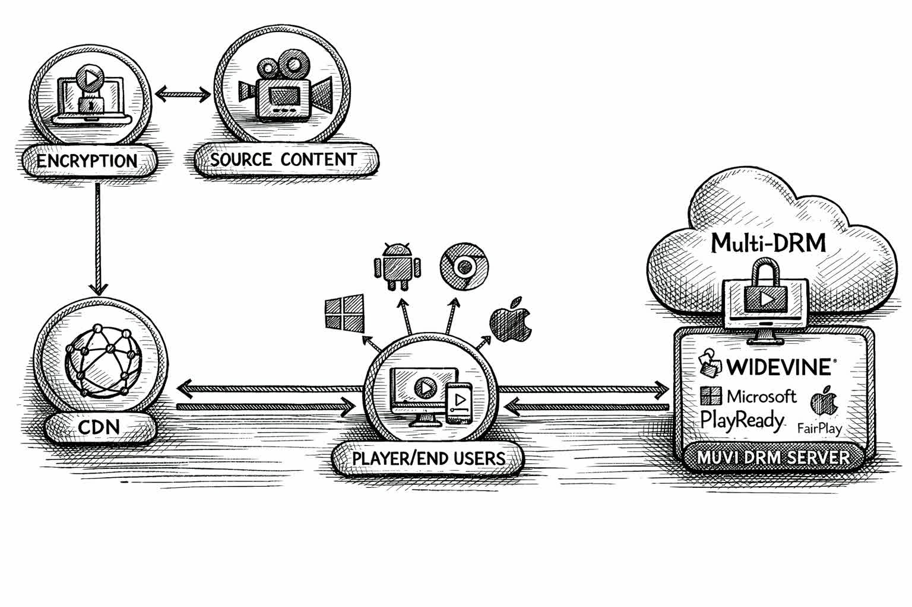

## What happens when you hit "Play"?

Modern streaming requires a lot more complexity that what one might think. Every time you click play on Netflix, Spotify, or now even AI generation platforms like Udio, your browser initiates communication with a remote license server, decodes streamed in bytes in realtime, and does whatever it can to lock the end user (you) away from your own hardware. I wanted to learn how this all worked in detail and explore how the industry maintains this standard of digital stewardship. In this post I'll look at the handshakes between the browser and the gatekeepers, and finally, will develop a CLI tool that emulates this handshake, for educational purposes, how these encrypted bytes are assembled and delivered to the listener/viewer.

## The Architecture of Compliance

**Digital Rights Management (DRM)** exists to solve a delicate problem: how to provide data without granting possession. While standard HTTPS secures the transit of files, it cannot prevent a user from simply saving what they’ve received. To maintain proper digital order, the industry relies on a triad of actors: the **Content Server** (the warehouse), the **License Server** (the arbiter), and the **Content Decryption Module (CDM)**. The CDM is a proprietary _"black box"_ embedded in your browser or literally in your [CPU](https://en.wikipedia.org/wiki/Trusted_execution_environment), usually [Google’s **Widevine**](https://developers.google.com/widevine/drm/overview), that acts as a embassy inside your computer. It prevents you from accessing part of your own computer so gatekeepers can continue gatekeeping.

The process of "playing" a song involves several steps:

**The Manifest**: Your browser fetches an [HLS](https://en.wikipedia.org/wiki/HTTP_Live_Streaming) or [DASH manifest](https://docs.aws.amazon.com/mediatailor/latest/ug/dash-manifest-types.html) and finds a [**PSSH (Protection System Specific Header)**](https://developer.apple.com/documentation/http-live-streaming/using-content-protection-systems-with-hls) i.e. a small blob of bytes that tells the CDM which license server to petition.

**The Challenge**: The CDM generates an opaque **License Challenge** (a protobuf blob) that serves as a formal request for access.

**The Handshake**: This challenge is `POST`ed to the license server, which responds with a **License Response**.

**The Decryption**: The CDM parses this response to extract the content key. From here, the media segments are decrypted on-the-fly.

Depending on your hardware, you are assigned a "trust level." **L1** represents the highest tier, where decryption happens in a hardware-isolated environment, while **L3** is a software-only implementation. While L1 is the industry's gold standard, L3 remains the most accessible entry point for those of us looking to understand the protocol from the comfort of our own terminal.



## Building `udio-dl`

To build a functional client, I need to replicate the browser's behavior with just enough precision to satisfy the license servers. Google's widevine client is in Python so I'll stick with that. I'll test with Udio since it's a new member to the DRM club.

### Extracting song metadata from Next.js hydration payloads

Udio is a Next.js application, which means the data Ineed (like the song_path and title) is often buried in the initial page load to help the React frontend "hydrate." We use regex to sift through the `__next_f.push()` calls, what the compiled js of the framwork looks like, to find our target.

```py
def extract_song_info(html: str) -> dict:
  """Extract song metadata from the Next.js page HTML."""
  payload = ""
  for m in re.finditer(r'self\.__next_f\.push\(\s*\[.*?,\s*"((?:[^"\\]|\\.)*)"\s*\]\s*\)', html):
      # ... clean and concatenate the payload ...
  return _find_song_in_text(payload)
```

### Trying the easy path first i.e. direct MP3

Before engaging in complex part, I'll try the easy way first. Some tracks still offer a plain MP3 URL; I attempt a simple GET and, if the server is feeling generous, I bail early with our file in hand.

### Fetching the HLS manifest

When the MP3 returns a `403 Forbidden` I fall back to the `manifest.m3u8` and parse the `#EXT-X-KEY` to find the **Key ID** and the **PSSH** blob.

### Obtaining the decryption key with `pywidevine`

I use a `.wvd` file (a virtualized L3 CDM which intructions on how that works in the Bonus section) to generate a **License Challenge**. This is a formal petition for access. I `POST` it to the license server, which (if it finds the credentials acceptable) returns a **License Response**. My CDM then extracts the raw secret: the **Content Key**.

```py
def obtain_content_key(cdm_path: Path, pssh_b64: str, key_id: str) -> str:
  device = Device.load(cdm_path)
  cdm = Cdm.from_device(device)
  session_id = cdm.open()
    
  # The polite request
  challenge = cdm.get_license_challenge(session_id, PSSH(pssh_b64))
  resp = SESSION.post(LICENSE_URL, data=challenge)
  cdm.parse_license(session_id, resp.content)

  # The secret revealed
  for key in cdm.get_keys(session_id):
    if key.kid.hex == key_id:
      return key.key.hex()
```

### Downloading & decrypting the stream

Finally, I download the initialization and media segments, concatenating them into one encrypted `.m4a`. Because I now hold the key, I don't need to re-encode anything. I simply use `ffmpeg` to unwrap the encryption and step out of the ecosystem with a clean file.

```py
subprocess.run([
    "ffmpeg", "-decryption_key", key_hex,
    "-i", "encrypted.m4a",
    "-c", "copy", "decrypted_song.m4a"
])
```

## Bonus: Automating CDM extraction

<Callout type="info">
I wasn't going to publish this bonus section because I'm not trying to get myself in hot water but it felt less sus publishing it after claude code one-shotted making the CDM extraction script. lol
</Callout>

To actually use the script above, you need a "Device File" (`.wvd`), essentially a digital identity that the license server recognizes as a legitimate, compliant listener/viewer. While you could scour the dark corners of the internet for one, but it is far more educational to manufacture your own using a controlled environment.

The `setup_cdm.py` script in the repo attached below automates this process of "digital credentialing." It boots a headless Android emulator and uses **Frida**, a dynamic instrumentation toolkit, to inject code into the emulator's running processes. By running a tool like **KeyDive**, I can intercept the moment the emulator's internal CDM initializes itself. Since the emulator is a software-based environment, it lacks the "hardware root of trust" required for high-security **L1** status. Instead, it operates at **L3**, where the secrets are kept in software memory that I, as the masters of the hypervisor, can ultimately observe.

This process requires some architectural heavy lifting. Depending on your host OS, the script leverages `KVM` on Linux or the `Hypervisor.framework` on macOS to ensure the emulator runs with enough performance to satisfy the timing checks of the DRM handshake. Once the extraction is complete, you are left with a private `.wvd` file, your very own diplomatic passport for the world of Widevine.


## Takeaways

After peeling back the layers, we find that DRM is not "encryption magic." It uses the same **AES-128-CTR** encryption that secures most of the modern web. The _"secret sauce"_ isn't the math; it’s the **Trusted Execution Environment (TEE)**, that sovereign embassy in your hardware.

The industry accepts that **L3 CDMs** are inherently fragile because software-only protection can always be observed by a sufficiently determined host. The real gatekeeping happens at L1, where the keys are locked inside hardware enclaves that even your operating system cannot peek into.

Ultimately, DRM is an access-control protocol masquerading as security. It's pretty shitty that it exists but legacy Rights Holders like Record Labels have lobbied the government extremely well. It is a system designed to ensure that while the bits are on your drive and the waves are in your ears, the ownership remains firmly in the hands of the gatekeepers. This exercise is, of course, **for educational purposes only**. Understanding the locks on your own front door is the first step toward digital literacy, just remember to respect the creators whose work lives behind those locks.

<OgLink url="https://codeberg.org/jonaylor89/udio-dl" />

