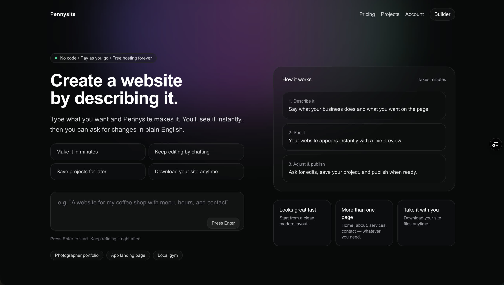
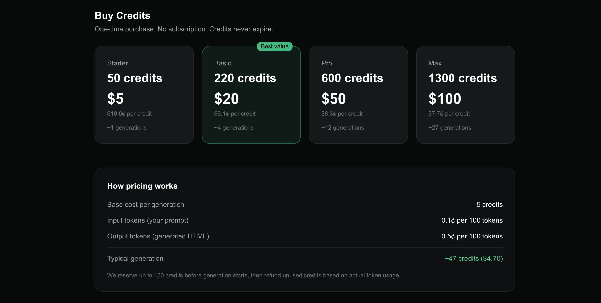

Most ai website builders cost about $25 a month.

| AI Website Builder                    | Price (USD) |
|---------------------------------------|-------------|
| [Lovable](https://lovable.dev/pricing) | $25 / month |
| [Bolt.new](https://bolt.new/pricing)   | $25 / month |
| [v0](https://v0.dev/pricing)           | $20 / month |
| [Replit](https://replit.com/pricing)   | $25 / month |

Even just hosting for website already built require some kind of subscription if you're noto technical enough to use git, github, vercel/netlify/cloudflare/etc

A couple examples:

| Hosting Provider      | Price (USD)       |
|--------------|--------------------|
| [Hostinger](https://www.hostinger.com/pricing#pricing)    | $1.99–$2.99 / month|
| [InterServer](https://www.interserver.net/webhosting/)  | $2.50 / month      |
| [FastComet](https://www.fastcomet.com/pricing)    | $2.39 / month      |
| [GoDaddy](https://www.godaddy.com/pricing?category=Hosting)      | ~$6 / month        |

That price has become so normal we don’t question it anymore like a gym memberships you forgot to cancel. The problem is: most people don’t use a website builder every month. They use it intensely for a weekend, maybe a week, and then... never again. Charging recurring rent for a one-time act feels wrong. So I built [Pennysite](https://pennysite.app), a website builder that costs pennies instead of $25/month.

This wasn’t some growth hack. It was the core design constraint.

# The $25/month lie

Website builders sell "unlimited" everything:

- unlimited pages  
- unlimited edits  
- unlimited creativity  

But websites aren’t something you're editing daily. Most websites follow the same lifecycle:

1. Create site  
2. Tweak a few things  
3. Publish  
4. Forget it exists  

Subscriptions optimize for **retention** which, if the above is true, isn't the goal. The goal of a website builder for anyone on the otherside of the [chasm](https://en.wikipedia.org/wiki/Crossing_the_Chasm) ought to be how quickly and efficiently a layman can get a decent website to start accepting traffic on their cool, shiny domain name they bought. 

<Callout type="info">
If your pricing assumes I’ll still be editing my About page six months from now, you’re designing for the wrong behavior.
</Callout>

With Pennysite, **pricing is usaged based**. Users purchase credit packs to interact with the agent (built with [pi](https://github.com/badlogic/pi-mono/)) and are billed based on how much work the agent does to create their vision. And just like what ever developer platform offers: **hosting is free**. Thanks to some clever cloudflare tricks, I could avoid charging for hosting and create something that's truly set-and-forget. As a developer, it's insane to even consider paying for static website hosting and that's the philosphy I've brought to Pennysite. **This includes custom domains**; anyone that charges to add a custom domain should be hanged, drawn, and quartered.

# Forgettable as a Feature?

Charging based on usage forced several design constraints:

- **Static HTML only**  
  No databases. No runtime. No background jobs.
- **Exportability by default**  
  If users are paying per action, they *must* own the output.
- **No infinite tweaking loops**  
  Every generation costs something, even if it’s tiny.

It won't have the functionality of Lovable, the speed of Bolt.new, the great, complex design like v0, but it isn't something subscription to stress about. Hell, I've personally struggled with subscription fatigue: I signed up for a Bolt.new hackathon last year where I got a pro susbcription for free. Well, a couple month go by and I notice I was getting charged for it! Apparently the free pro subscription was only for the duration of the hackathon. That wouldn't happen with Pennysite.

# Fast fashion software, revisited

A while back I wrote about [*fast fashion software*](https://www.jonaylor.com/blog/i-quit-my-500k-software-job)—tools that are cheap, fast, disposable, and purpose-built. At the time, I didn't really have an idea what I'd build in the next few months. So far there's been _a lot_ of small tools/clis and some larger ones like [SaintJohn](https://saintjohn.jonaylor.com) and [pennysite](https://pennysite.app). With VC backed start ups moving more and more away from providing value to customers and focusing more on their bottom line, these fast fashion projects I create make me more optimistic about the state of software. Software doesn't need to justify its own long-term existence; It just needs to do its job and get out of the way.

Try it at [https://pennysite.app](https://pennysite.app)

<YouTube id="WgI0j0Y7rwE" />

<Callout type="warning">
This is a public beta so, while the proof of concept works, the quality of agents and websites products is still being improved. Report bugs as [github issues](https://github.com/jonaylor89/pennysite)
</Callout>
