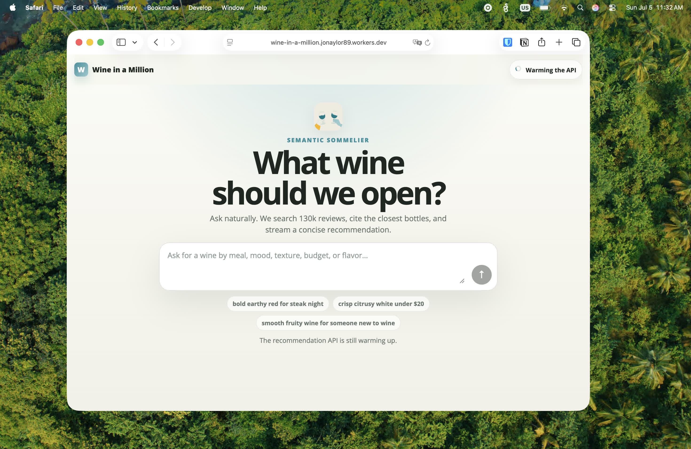
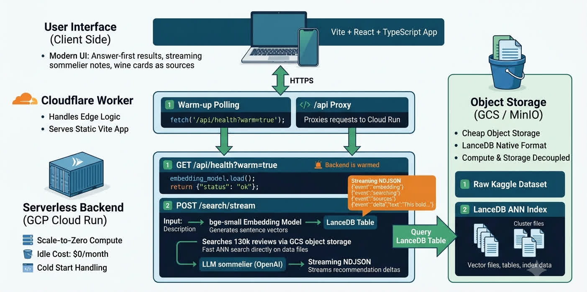

# From SageMaker to LanceDB

A few years ago, I wrote a tutorial on [how to build a wine recommendation engine using sentence-BERT embeddings and nearest-neighbor search](https://www.jonaylor.com/blog/create-a-wine-recommender/) (which was originally off of a older hackathon win). For a time, this was probably my most popular blog post with it even getting published on [Capital One's engineering blog](https://www.capitalone.com/tech/machine-learning/create-wine-recommender-using-nlp/). Because I was pretty deep in AWS's ML stack at the time, the tutorial looked a lot like: spin up a heavy, managed ML environment with AWS SageMaker, run your training jobs, save data as massive CSVs in S3, and deploy an always-on endpoint to handle inferences.

It worked but [a lot has happened in the ML and NLP space in the last 5 years](https://arxiv.org/abs/2005.14165) to say the least. In 2026 in the year of our lord, embedding models are insanely good, developer products like [LanceDB](https://www.lancedb.com/) makes things much easier than managed SageMaker instances, and web streaming means I can make the same thing now with better performance, cleaner code, and big drop in costs.

This is a 2026 refresh of how to build a simple wine recommender with using fancy NLP techniques.

# The Modernized Stack

The core product is exactly the same: describe a wine you want e.g. "bold earthy red for steak night" and it searches 130k wine reviews from a Kaggle dataset for the closest matches. But the underlying stack is completely different.

Here is how the infrastructure changed:

| Component      | 2022 Architecture               | Modernized Stack             |
| -------------- | ------------------------------- | ---------------------------- |
| Compute Engine | SageMaker Notebooks & Endpoints | FastAPI Backend on Cloud Run |
| Vector Engine  | scikit-learn Nearest Neighbors  | LanceDB ANN Index            |
| Storage Layer  | Embeddings CSV in AWS S3        | LanceDB table in GCS         |
| UI Integration | Traditional JSON API Response   | Streaming NDJSON             |

The main architectural bet here is that your vector index does not need to be a database server.

In the old version, we had to choose between a brute-force scikit-learn search over a raw CSV loaded in memory, or provisioning an expensive, always-on vector DB cluster. LanceDB changes that completely so it stores its files directly in object storage. The index sits in cheap storage until a request comes in. Cloud Run spins up a FastAPI container, queries the LanceDB table directly out of GCS using Approximate Nearest Neighbor (ANN) search, and shuts back down.

# Streaming Answers

The original UI followed a basic CRUD pattern: you typed your query into a search box, clicked submit, waited for the inference pipeline to run and the entire response to finish, and eventually the screen populated. One of the more niche things that ChatGPT's done is make end users expect streamed responses from apps so the updated UI uses some of the run new web tools to stream responses from the LLM and from LanceDB. The updated UI is also built around a conversational, search-first layout that feels more like Perplexity. For shits-and-giggled I added a "sommelier note" which is just an LLM summarizing the response which also felt more Perplexity-esque.

So, instead of making the user stare at a blank loading state while the embedding model runs, LanceDB searches, and the LLM thinks, the server streams a sequence of NDJSON events. The UI reacts to these events in real-time as they fire off:

* `embedding request`: The UI surfaces active progress feedback so the user knows the server is processing their text.
* `searching LanceDB`: The vector index is queried.
* `wine sources found`: The matched wine cards instantly pop into the UI as "sources" to provide immediate visual context.
* `recommendation deltas`: The final generated sommelier note streams onto the page line-by-line, explaining the picks while the user is already looking at the bottles.

By breaking the response into an asynchronous stream, the perceived performance seems better.

# Conclusion

Modern recommendation systemsj are easier than ever to make but also have higher expectations now from end users than even just a few years ago. What used to take an entire 24 hour hackathon and expensive cloud compute can now be done in an hour using local embedding models. 

The full source code, the infrastructure setup, and the updated frontend are all on GitHub:[https://github.com/jonaylor89/WineInAMillion](https://github.com/jonaylor89/WineInAMillion)

And the project/demo is deployed on Cloudflare: [http://wineinamillion.jonaylor.com/](http://wineinamillion.jonaylor.com/)
