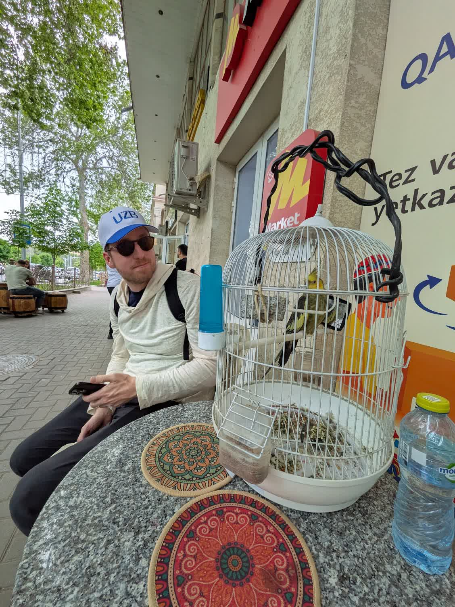
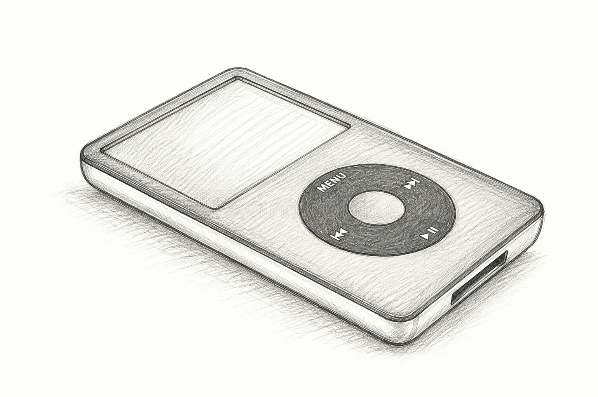

From mp3 players to streaming, music is more accessible now than ever before in history. If you wanted to, you could probably listen to music all day every day and, in fact, I've seen some people's Spotify Wrapped hours-listened on IG that make me think they do listen to music all day every day. I'm not too crazy but even before I started working in music-tech, I generally listen to a fair amount of music every day. Headphones in on the walk to a cafe, headphones in while working, playing music on my phone in while doing nothing in particular. Any bit of silence could be filled immediately, and I filled it.

As genuinely dumb as it sounds, I think that's not the right way to be going about things. I've found on my walks or sitting at my desk, I get significantly better ideas and clearer/deeper thoughts when I'm not playing music. This isn't _just_ from the walks because absolutely walks in general are great for ideating but I have completely  different walks when I don't have headphones on and I'm just listening to the world. It's a thing that boredom is how you get your best thoughts and ideas so this seems to be an extension of that.

<Callout type="info">
This is a tangent but I also tend to talk to strangers and be more social in my neighborhood when I don't always have headphones on. Unfortuntely there's still crazy people who get on the subway so it's impossible for me to _never_ have headphones with me as an option.
</Callout>

That said, I don't think the answer is sterile quiet all the time. Some background noise is great. One of my favorite things I noticed in Central Asia was how restaurants and coffee shops had birds hanging in cages whose purpose is to be background noise so the place isn't quiet. There’s a difference between ambient life happening around you and infinite streams of music. Listening to music all the time isn't [Lindy](https://en.wikipedia.org/wiki/Lindy_effect). People have been sitting around talking, drinking tea, listening to birds and room noise for a lot longer than they've been looping through Spotify's Discover Weekly.

This sounds absurd and I'm obviously not anti-music. If anything, I'm enjoying music more now that I don't have it on all the time. I've actually been downloading music onto an old iPod ([which I'm of course paying for because I _love_ supporting music labels and the establishment](https://www.youtube.com/watch?v=zGM8PT1eAvY)) and listening offline, which has been a huge help because it makes music feel intentional again and keeps me from always being connected to the internet. Now I try to either listen to music while I'm locked in, or listen to music as the thing I'm doing: at a live show, playing vinyl, walking around with the iPod, etc. It's genuinely hard not to put headphones in on a walk or when I'm ideating at my desk because music is addicting, but the T break thing is real. The dopamine hits harder when it's not the default state of being alive.

