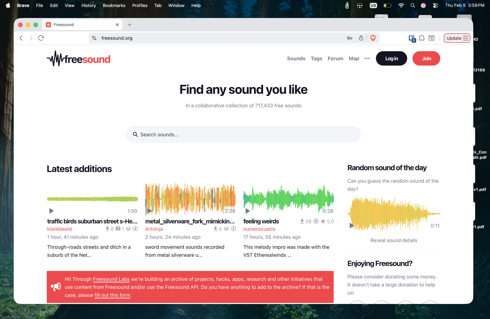
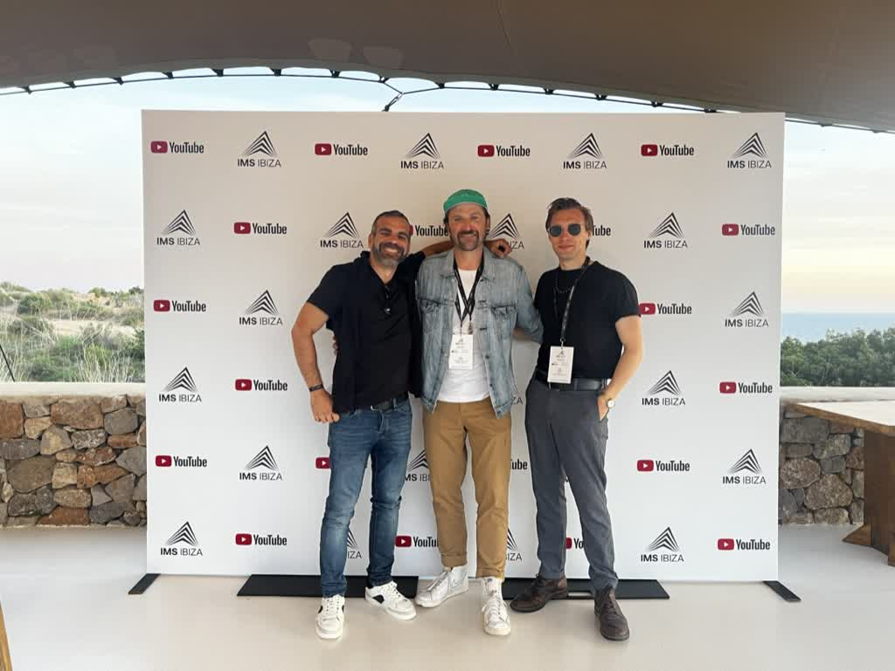
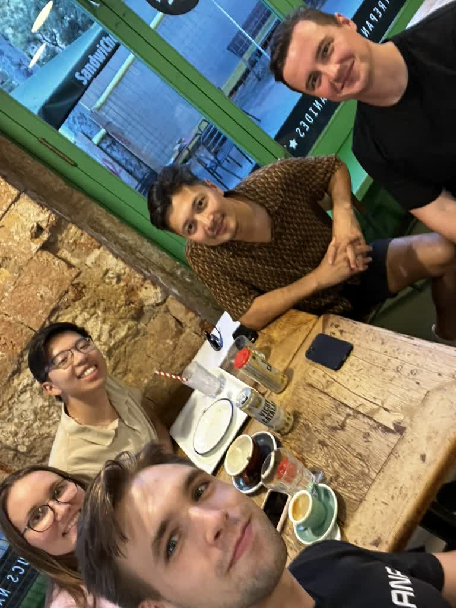
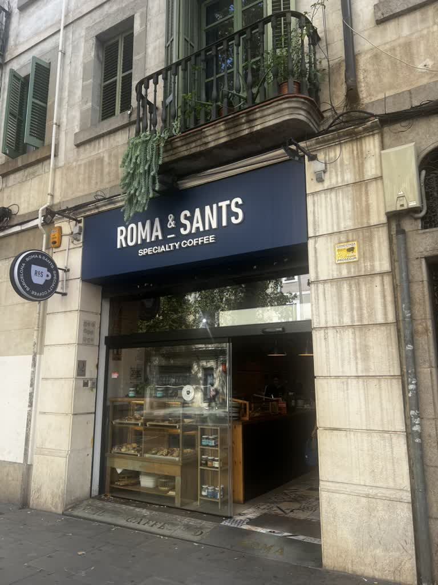
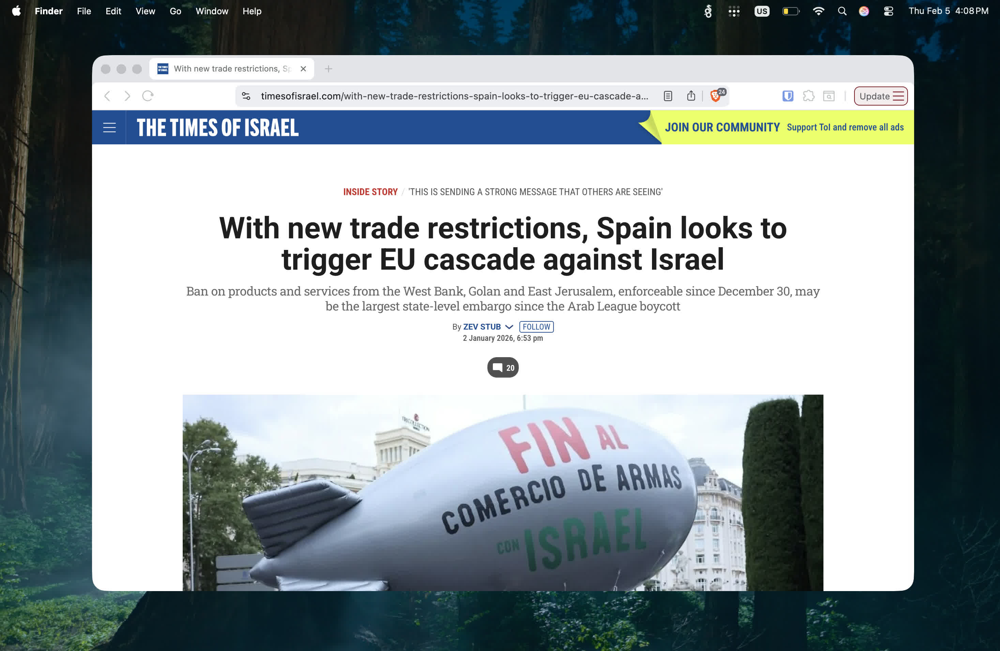

# Més enllà del Modernisme

Què significa ser la "capital" d'alguna indústria? Ha de tenir aquesta ciutat les seus de les empreses mes importants? Els innovadors més brilliants? Una de les bases de clients més grans? Què passa amb tot l'anterior en el cas de la indústria de la Music Tech a Barcelona?

Barcelona no és només una ciutat de sol i turisme; és el nucli de la Music Tech a Europa. Des de la recerca d'avantguarda de la Universitat Pompeu Fabra fins al BMAT que monitoritza el que es juga arreu del món, l'ecosistema de Catalunya és fantàstic. I amb la proximitat estratègica d'esdeveniments com IMS a Eivissa i Sónar+D, la ciutat s'ha convertit en el punt de trobada natural d'executius de Londres, Berlín, fins i tot els Estats Units.

# El bressol acadèmic: UPF i el Music Technology Group (MTG)

L’èxit de Barcelona com a hub no és casualitat, sinó que té una base acadèmica sòlida amb el [Music Technology Group (MTG)](https://www.upf.edu/web/mtg) de la Universitat Pompeu Fabra. Aquest centre ha situat la recerca musical de la ciutat a la mateixa alçada d’institucions globals com la NYU, convertint-se en la pedra angular de tot l'ecosistema local.

l'MTG és un referent mundial en el camp del [Music Information Retrieval (MIR)](https://en.wikipedia.org/wiki/Music_information_retrieval), la ciència de recuperar informació de la música, i el seu impacte traspassa les aules per arribar a la indústria global. Un dels seus pilars és Essentia, una biblioteca open-source per a l'anàlisi d'àudio que s'ha convertit en l'estàndard del sector; de fet, gegants com Spotify o Pandora la utilitzen per entendre, processar, recommendar la música que escoltem. A més, el grup és el responsable de [Freesound.org](https://freesound.org), una de les bases de dades de sons creatius més grans del món, una eina col·laborativa essencial per a milers de productors i creadors arreu del planeta.

# Sónar+D: On la recerca troba la festa

A Barcelona, la innovació no es limita als labs, sinó que surt al carrer a través de congressos com el [Sónar+D](https://sonar.es/en/programme/sonar-d). Més que un apèndix del festival, la part professional dels esdeveniments val la pena per si mateixa; un espai on les jerarquies es dilueixen i és perfectament possible trobar-hi un estudiant de doctorat presentant un prototip de synth a un DJ de primer nivell.

Aquest ecosistema està ple d'esdeveniments que miren cap als negocis i l'estratègia i la connexió amb la [International Music Summit (IMS)](https://www.internationalmusicsummit.com/) d'Eivissa el completa. La cimera és el referent mundial de la indústria, fins al punt que referents com [MIDiA Research](https://www.midiaresearch.com/) l'escullen per presentar el seu informe anual, posicionant el nostre centre geogràfic com el lloc on es defineixen les tendències del mercat.

<figure>

<figcaption>Ara de Soundstage, Niall de Future Music Forum i MIDiA, i jo a Eivissa per IMS</figcaption>
</figure>

# El triangle: Barcelona – Berlín - London

La posició geogràfica de Barcelona no és només una qüestió de qualitat de vida, sinó un actiu estratègic. La ciutat actua com un node perfectament connectat amb els altres grans centres europeus de Music Tech; amb vols de 50 € a Berlín o Londres, la col·laboració entre equips i la presència a fires internacionals és senzilla.

A més, Barcelona ofereix un avantatge competitiu únic: el seu volum constant de turistes i assistents a festes crea el camp de proves ideal per a qualsevol startup. Tens accés immediat a un mercat global de beta testers que et permet validar productes de consum amb cohorts d'usuaris reals de tot el món abans de llançar-te al mercat a gran escala.

Aquesta hiperconnectivitat és el que també facilita l'accés al talent. Avui dia, atraure desenvolupadors sèniors d'Alemanya, el UK, espanyols nadius o fins i tot dels US és més fàcil que mai; Barcelona és una ciutat que és molt fàcil de convèncer a la gent perquè provi i, per descomptat, tothom acaba estimant-la i volent quedar-s'hi. La barrera de la distància ha desaparegut: fins i tot per a algú de Nova York, un bitllet de $200 és suficient per arribar a la ciutat. Al final, Barcelona no és només una seu, és el lloc on el talent vol ser, i Music Tech n'és la gran beneficiada.

<figure>

<figcaption>Amb l'equip de <a href="http://Lingo.dev">Lingo.dev</a> (YC F24) i Tair de Sync (YC W24) a un Sandwichez a Sant Antoni</figcaption>
</figure>

# Conclusió: El futur és híbrid 

Mentre Berlín té l'aura de "cool" i Londres manté el múscul financer d'una gran capital, Barcelona ha aconseguit alguna cosa molt més difícil: la integració total de la recerca acadèmica, la indústria real i un camp de proves immillorable com els seus clubs i festivals. No és només un lloc per idear tecnologia, sinó el lloc on aquesta tecnologia es valida i es consumeix.

L'èxit de projectes com BMAT, Unison, GigWell o MySheetMusicTranscriptions és la prova que aquest ecosistema funciona. I més enllà de l'excel·lent qualitat de vida que tothom coneix, Barcelona ofereix una relació senyal-soroll immillorable per a qualsevol emprenedor. Jo diria que una ciutat com Nova York o Londres té massa soroll i distraccions com per no aconseguir res. Barcelona té prou senyal per justificar viure-hi a temps complet, però prou "soroll" creatiu per inspirar-se i per "touch grass" metafàticament.

<figure>

<figcaption>Roma&amp;Sants, un cafe al Carrer de Sants, on es va escriure la major part del codi de la meva start-up <a href="https://tapped.ai">Tapped Ai</a></figcaption>
</figure>

---

Per descomptat, hi ha altres motius per respectar Espanya…

