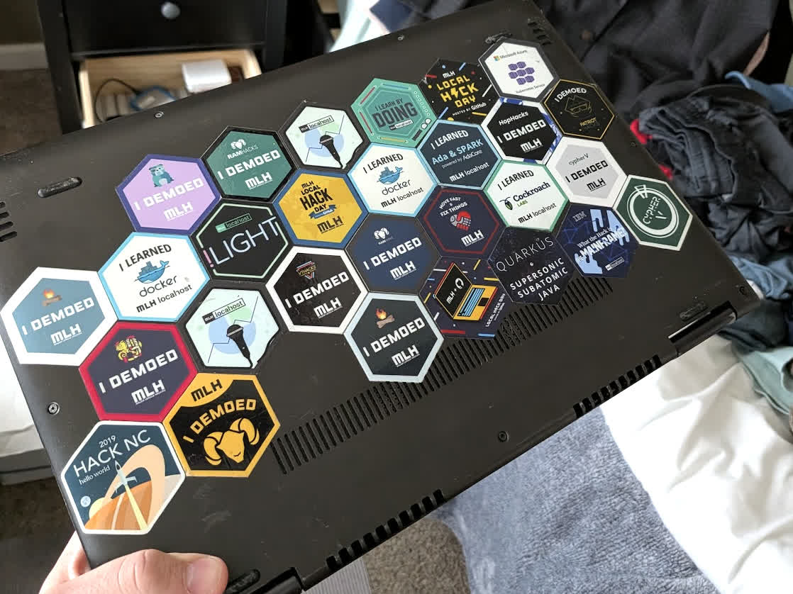
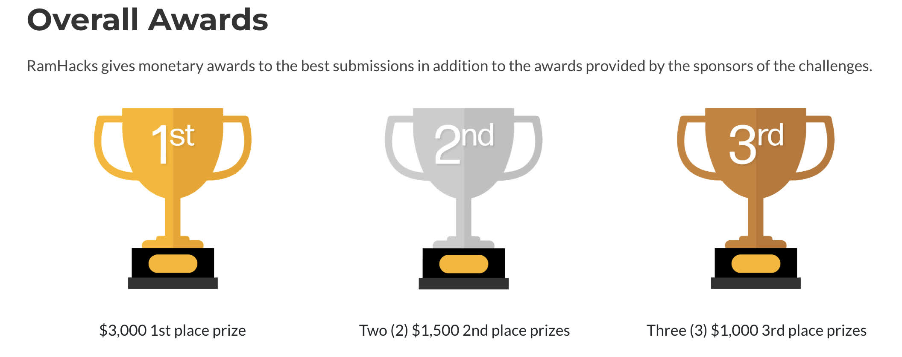

<Callout type="info">
Hackathons got weird after COVID, but it seems they’re coming back with organizations like [Cerebral Valley](https://cerebralvalley.ai/u/cv). I say that because some of this information pertains to pre-COVID-style, in-person hackathons, which seem to be making a comeback.
</Callout>

I’ve had people ask me over the last few years how to organize a hackathon and what makes a "good" one vs a "bad" one. Usually, those asking are non-technical or semi-technical; they know how useful hackathons can be for things like GTM or sourcing talent, but don’t know where to get started. Unfortunately, many of these people think organizing a hackathon is simple and just requires booking a coworking space and setting big cash prizes. Those people usually end up hosting the worst hackathons, the ones that feel extractive. A good hackathon, like most things in life, should feel positive-sum, where everyone gets something out of it.

I’ve seen hackathons done well this way plenty of times while in college, taking buses and carpooling to hackathons in the [DMV area](https://en.wikipedia.org/wiki/Washington_metropolitan_area), and (I hope) managed to make this happen when I organized [VCU’s RamHacks in 2020](https://www.notion.so/On-American-Unity-2fc71f811a4a80ac827efc43486185d5?pvs=21). 

# The Good

So what are some characteristics of a good hackathon?

### Many Sponsors

Unless it’s an internal corporate hackathon, hackathons hosted by one company or with just one sponsor are so boring. Participants want options. With more sponsors, there are more challenges to choose from. With more challenges, there are potentially more tech stacks participants can tinker with, more unique APIs or technical problems to solve, and, of course, more opportunities for prizes. Additionally, a lot of participants are there for job searching and new opportunities, so more sponsors means more chances to get the attention of a future employer. Also, while a lot of hackathons have themes, it’s still great to get a diverse selection of sponsors so it’s not all just competitors in the same space; e.g., for a music hackathon, bring Suno, Splice, BeatStars, DICE, etc., who all do different things in the music-tech space.

### Goldilocks Challenges

I’ve seen challenges be scoped super broad, and I’ve seen challenges be scoped very narrow. The ideal challenge is somewhere in the middle. Don’t have a challenge be "make an app" 😒 or "use our API for something" because, wtf, no, that’s too broad. There’s zero creativity in that, and how does one even measure success? The reverse can also be frustrating; challenges like “build an app to book rooms in a fake office” are more of a task than a challenge. With a narrow, “task”-sounding challenge, there isn’t any opportunity for creativity on the side of the participant, and the goal then just becomes a race to see which team can build it first.

### Unique Prizes

Credits for your API or cloud service, or a free trial to your pro service, are not a prize. Give a damn Nintendo Switch. I’m so tired of seeing Google offer GCP or Gemini credits. Cash prizes, while better, also show a major lack of creativity. It’s like getting cash as a Christmas gift: you’re happy you got the cash, but it also feels very transactional. I’ve seen companies give away hardware like reMarkable notebooks, Raspberry Pis, refurbished laptops, nice keyboards, and even entire servers as prizes, which is fun. Outside of hardware, software subscriptions are *fine* as long as they’re not just the challenge sponsor’s own company subscription. In the end, it pays to be creative, so just go crazy.

### Lots of Opportunity to Win

The benefit of having a diverse set of sponsors, challenges, and prizes is that there’s more than one chance for a team to win. For RamHacks, we had sponsor prizes (for their respective challenge), [Major League Hacking](https://mlh.io/) (MLH) prizes, and our overall prizes (which had to be cash because of COVID). As a participant, I’d be much more engaged if I thought there was a chance for me to win something, so with a good variety of challenges and prizes, there will be some challenges that are very competitive and others with less attention that more junior engineers might submit something for.

### Goldilocks Hacking Length

One of the things COVID ruined was all-nighter hackathons. All the hackathons I see nowadays are either 12 hours or a week long. Twelve hours is too short, in my opinion, and feels like a speedrun, and week-long hackathons have insane participant churn. I’ve *never* completed a week-long hackathon. My favorites were the 24-hour hackathons from 11am to 11am and perhaps also the 36-hour hackathons that go from, let’s say, 8am to 8pm the next day. That timeframe lets participants lock in with some breathing room for a nap, socializing, or eating. Bring back all-nighter hackathons.

### Comfortable Space with Good WiFi

Technical difficulties are a dime a dozen, but there’s no worse feeling than being at a hackathon and the Wi-Fi doesn’t work or it’s some shitty guest Wi-Fi. Figure that out because it goes without saying that it’s extremely important. Similarly, it’s great to have a space that fits everyone, with a few private rooms for teams to hide out in or for tech talks/workshops to be held.

### FOOD!!!

This one is kind of obvious, but if you’re gonna host people in a space for 24 hours, make sure there’s plenty of healthy food and a good balance of snacks. For RamHacks, we gave people meal tickets and invited food trucks to pull up. Along with this, coffee is a must, and caffeinated snacks are always fun.

# The Bad

Characteristics of a bad hackathon just look like the negative of the above. i.e.

- Single company hackathons
- Generic / overly broad challenges
    - "Build an app"
    - "use out API"
- Time period too long or too short e.g. 12hr or 1 week
- Bad space with overly aggressive security (e.g. NYU security)
- Company credits as a prize or basic cash prizes (or no prizes!)

These can all be avoided with better preparation and more empathy for the participants.

<Callout type="info">
🚫 A major red flag which should be mentioned is hackathons that think they own the IP of the submission. Hackathons are not sweatshops and **participants own 100% of their creations**. There have been a number of people who approach me who want to use hackathons as a way to get free labor which is obviously a major no-no. If you like what the hacker builds, approach them afterwards and pay them.

</Callout>

# Tips for Organizing a Hackathon

MLH already created a reasonably comprehensive guide for organizing a hackathon (https://guide.mlh.io/), so I won’t go into too much detail about how to organize a hackathon, but rather share basic tips that helped me.

### Document everything

This applies to nearly all events, but it’s so helpful to keep a spreadsheet CRM for sponsors, spreadsheets for judging criteria, and sponsor or participant packets that tell people when and how to operate. Your hackathon is not gonna be on people’s minds 24/7, and they’ll be forgetting things (so will you!) all the time; thus, documentation and spreadsheeting really come in handy (this is coming from someone who isn’t normally a spreadsheet person). And if you ever decide to do another hackathon next year, you’ll thank yourself.

### Coffee & Caffeine

There will be lots of caffeine at the hackathon, and people will be crushing it in unhealthy quantities. At RamHacks, we had a barista from the local cafe, caffeinated chocolate, chocolate-covered espresso beans, energy drinks, etc. With that, it was useful to have an EMT or paramedic nearby because some kid always ends up consuming too much.

### Communication

Slack and Discord are the classic communication platforms but kind of annoying to use (slack feels like work and I don’t really like Discord). That being said, all the custom communication solutions I’ve seen for hackathons I also don’t like. I suppose tl;dr is there’s no perfect way to do communication so just figure it out as best you can with your intended audience.

### Hygiene

Overnight hackathons can get unsanitary so it helps to pass out goodies like toothbrush/paste, mouth wash, feminine sanitary pads. When I would carpool to hackathons, I'd bring dry shampoo for example. It benefits everyone. 
